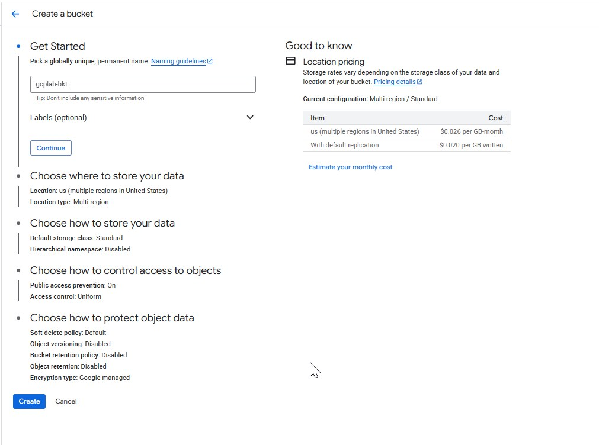
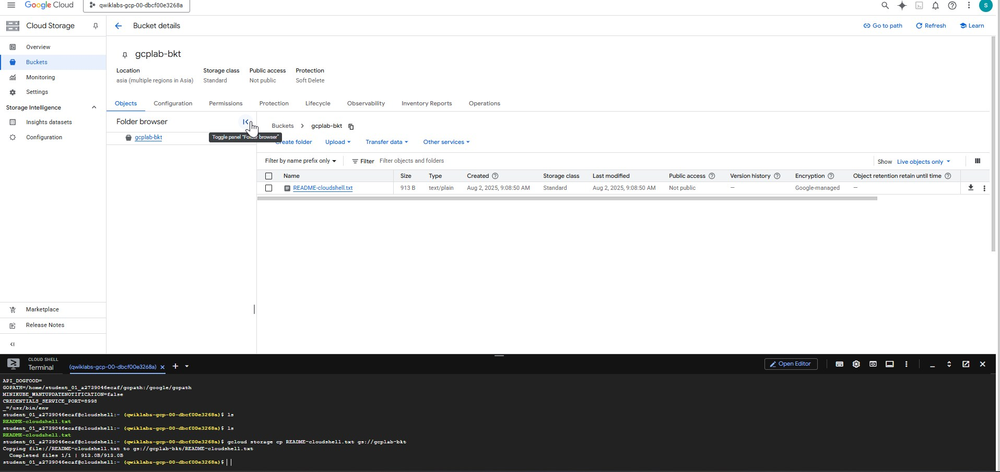

# 🪣 Google Cloud Storage Buckets: A Complete Guide for Beginners

In the world of cloud computing, **object storage** has become essential for storing and managing large volumes of unstructured data like images, videos, backups, and logs. **Google Cloud Storage (GCS)** is Google Cloud’s answer to scalable, secure, and highly durable object storage.

This blog post will walk you through everything you need to know about **GCS Buckets**, including their features, types, pricing, use cases, and how to create one using the console, CLI, and Terraform.

---

## What Is a Google Cloud Storage Bucket?

A **Cloud Storage bucket** is a container for storing **objects (blobs of data)**. Think of it as a folder in the cloud where you store files, images, backups, etc.

Each object consists of:

* **Data** (the content)
* **Metadata** (custom and system-defined)
* **A unique name** (object key)

Buckets are globally accessible and integrated into the **Google Cloud ecosystem**.

---

## Key Features of GCS Buckets

| Feature                 | Description                                   |
| ----------------------- | --------------------------------------------- |
| **Scalability**         | Store petabytes of data, seamlessly           |
| **Durability**          | 99.999999999% (11 9’s) durability             |
| **Availability**        | High availability options across regions      |
| **Versioning**          | Maintain multiple versions of the same object |
| **Lifecycle Policies**  | Automate deletion or transition of objects    |
| **IAM & ACLs**          | Secure access at bucket or object level       |
| **Event Notifications** | Trigger Cloud Functions on object changes     |
| **Object Lock**         | WORM (write-once-read-many) support           |

---

## Types of Storage Classes

GCS offers **4 storage classes**, all with the same latency and throughput, differing only by **availability and pricing**:

| Storage Class | Use Case                          | Minimum Storage Duration | Availability   |
| ------------- | --------------------------------- | ------------------------ | -------------- |
| **Standard**  | Hot data, frequently accessed     | None                     | Multi-regional |
| **Nearline**  | Monthly accessed data             | 30 days                  | Regional       |
| **Coldline**  | Accessed less than once a quarter | 90 days                  | Regional       |
| **Archive**   | Rare access, long-term archive    | 365 days                 | Regional       |

---

## Bucket Location Types

| Location Type    | Description                          | Example                     |
| ---------------- | ------------------------------------ | --------------------------- |
| **Multi-region** | High availability across large areas | `US`, `EU`, `ASIA`          |
| **Dual-region**  | Redundancy in two regions            | `asia1` (Singapore + Tokyo) |
| **Region**       | Data stored in a single region       | `us-central1`               |

---

##  How to Create a Bucket

### ✅ 1. **Using Cloud Console**

1. Navigate to **Storage → Buckets**
2. Click **Create**
3. Set a **globally unique name**
4. Choose **location**, **storage class**, and **access control**
5. Click **Create**

   
   
   
   
   
   
   
   
  


---

### ✅ 2. **Using gcloud CLI**

```bash
gcloud storage buckets create gs://my-demo-bucket \
  --location=us-central1 \
  --storage-class=STANDARD
```  

  
 
copying objects to bucket  


---

### ✅ 3. **Using Terraform**

```hcl
resource "google_storage_bucket" "demo" {
  name          = "my-demo-bucket-123"
  location      = "US"
  storage_class = "STANDARD"
  force_destroy = true
}
```

---

## Security and Access Control

You can control access at:

* **Bucket level**
* **Object level**

### Options:

* **IAM policies**: Role-based access (recommended)
* **ACLs**: Fine-grained access (legacy option)

```bash
gcloud storage buckets add-iam-policy-binding my-demo-bucket \
  --member="user:john@example.com" \
  --role="roles/storage.objectViewer"
```

---

##  Lifecycle Management

Automate actions like deleting old objects or transitioning them to colder storage.

Example: Delete objects older than 30 days

```json
{
  "rule": [
    {
      "action": {"type": "Delete"},
      "condition": {"age": 30}
    }
  ]
}
```

Upload this policy:

```bash
gsutil lifecycle set lifecycle.json gs://my-demo-bucket
```

---

##  Real-World Use Cases

| Use Case                     | Storage Class        | Example                 |
| ---------------------------- | -------------------- | ----------------------- |
| Web assets (images, JS, CSS) | Standard             | Website CDN             |
| Backups                      | Nearline or Coldline | SQL dumps, VM snapshots |
| Video archives               | Archive              | Surveillance footage    |
| Data lakes                   | Standard/Coldline    | Logs, IoT sensor data   |

---

##  Pricing Overview (As of 2025)

| Storage Class | Storage per GB | Access Cost | Min Duration |
| ------------- | -------------- | ----------- | ------------ |
| Standard      | \~\$0.020      | Free        | N/A          |
| Nearline      | \~\$0.010      | \$0.01/GB   | 30 days      |
| Coldline      | \~\$0.004      | \$0.02/GB   | 90 days      |
| Archive       | \~\$0.0012     | \$0.05/GB   | 365 days     |

You also pay for:

* **Network egress** (outside GCP)
* **Operation charges** (list, write, delete)

> Always check the [latest pricing](https://cloud.google.com/storage/pricing) on Google Cloud's website.

---

##  Best Practices

✅ Use **Standard class** for active workloads
✅ Use **Nearline/Coldline/Archive** for backup and compliance
✅ Apply **lifecycle rules** to optimize costs
✅ Use **IAM roles** (not ACLs) for better security
✅ Enable **Bucket Policy Only (BPO)** for simplified access
✅ Enable **Object Versioning** for critical data
✅ Use **signed URLs** for temporary object access
✅ Monitor with **Cloud Monitoring and Logging**

---

##  Summary

Google Cloud Storage buckets are a powerful, flexible, and secure solution for storing virtually any kind of data. Whether you're hosting static websites, backing up data, or managing large-scale media libraries, GCS provides a scalable solution tailored for performance and cost-efficiency.

With support for multi-region redundancy, granular access control, and automated lifecycle management, Cloud Storage is a must-know service for anyone working in GCP.

---

