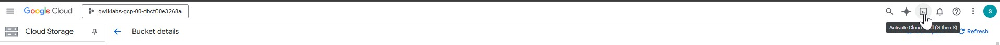
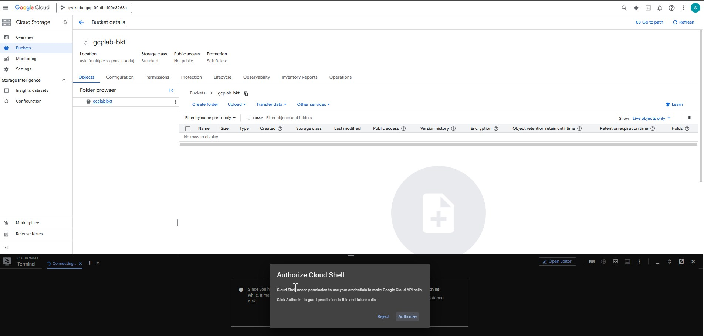
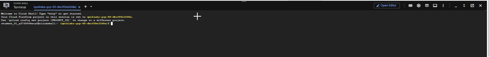

# Mastering Google Cloud Shell

Whether you're a seasoned cloud engineer or just starting your cloud journey, **Google Cloud Shell** is a powerful tool that simplifies working with Google Cloud Platform (GCP) — without the need to install anything locally.

In this blog, we’ll dive deep into what Cloud Shell is, its features, use cases, and best practices.

---

##  What is Google Cloud Shell?

**Google Cloud Shell** is a free, browser-based shell environment provided by Google. It gives users command-line access to **compute resources hosted on Google Cloud**, directly in the browser.

✅ **No installation required**
✅ **Pre-installed tools**
✅ **Persistent storage**
✅ **Web-based code editor (VS Code)**

---

##  Key Features

### 1. **Pre-installed GCP tools**

Cloud Shell comes with:

* `gcloud`: Google Cloud SDK CLI
* `kubectl`: Kubernetes command-line tool
* `terraform`, `bq`, `gsutil`, `sqlcmd`, and more
* Popular development tools: `git`, `vim`, `nano`, `python3`, `node`, etc.

### 2. **5 GB Persistent Disk**

Your home directory (`~/`) is stored on a **persistent 5 GB disk** across sessions.

### 3. **Built-in Code Editor**

Access a lightweight version of **Visual Studio Code** by clicking the **“Open Editor”** button or running `cloudshell edit`.

### 4. **Secure Environment**

Runs in an **ephemeral VM** with auto-terminated sessions after 20 minutes of inactivity.

### 5. **Access to All GCP Projects**

Easily switch between GCP projects with:

```bash
gcloud config set project <PROJECT_ID>
```

---

##  Getting Started with Cloud Shell

1. Sign in to your GCP account
2. Click the **Cloud Shell icon**  on the top-right of the Cloud Console  
   
3. In seconds, a terminal window opens at the bottom of the screen
  
it pop's up for authorization.  
  
You’re now ready to run any GCP command-line tool!

---

##  Example Use Cases

### ✅ 1. **Quickly Deploy GCP Resources**

```bash
gcloud compute instances create my-vm \
  --zone=us-central1-a \
  --machine-type=e2-micro \
  --image-family=debian-11 \
  --image-project=debian-cloud
```

### ✅ 2. **Create Infrastructure with Terraform**

```bash
terraform init
terraform apply
```

### ✅ 4. **Run Cloud SDK scripts**

Easily automate tasks like backups, billing exports, or IAM role changes.

---

##  Tips & Best Practices

| Tip                      | Description                                                |
| ------------------------ | ---------------------------------------------------------- |
| Use bookmarks            | Save commonly used projects or commands as aliases         |
| Don't store secrets      | Avoid storing credentials or API keys in your Cloud Shell  |
| Use `cloudshell` command | Launch editor, upload/download files, and open web preview |
| Use SSH keys for Git     | Configure `~/.ssh` for GitHub/GitLab integration           |
| Use multiple sessions    | Launch new shells from the "⋮" menu if needed              |

---

## Pricing

* **Cloud Shell is free to use**
* Includes: 5 GB persistent storage, f1-micro VM (\~0.5 vCPU, 1.7 GB RAM)
* You may be billed **only** if your session launches GCP resources (e.g., create a VM, deploy SQL DB)

---

##  Limitations

| Limit            | Value                                      |
| ---------------- | ------------------------------------------ |
| Timeout          | Auto-terminates after 20 min idle          |
| Session duration | Max 12 hours                               |
| Storage          | 5 GB persistent `/home` directory          |
| Performance      | Ephemeral VM (not for heavy compute tasks) |

---

##  Cloud Shell Editor (VS Code)

* Navigate to files in the sidebar
* Supports syntax highlighting, IntelliSense, extensions
* Run terminals and edit code side-by-side

> Great for editing Terraform, Python, YAML, and shell scripts directly from your browser.

---

##  Security and Access

* Tightly integrated with GCP IAM
* Shell inherits your GCP login identity
* Each session is isolated and secure

---

##  Real-World Scenario: Set Up a Web App with Cloud Shell

1. Launch Cloud Shell
2. Clone your app from GitHub
3. Use `gcloud app deploy` to deploy App Engine
4. Monitor logs with `gcloud app logs tail -s default`
5. Preview your app in-browser using Cloud Shell’s **“Web Preview”**

---

##  Conclusion

Google Cloud Shell is a **must-use tool** for anyone working with GCP. Whether you're managing infrastructure, deploying apps, or automating scripts, Cloud Shell provides a seamless, consistent, and secure environment directly from your browser — **no setup, no fuss**.

---