# How to Create a VPC in Google Cloud Platform (GCP): Step-by-Step Guide

A **Virtual Private Cloud (VPC)** is a foundational component in Google Cloud Platform (GCP) that allows you to define and control your virtual networking environment. Whether you're launching virtual machines, deploying Kubernetes clusters, or hosting a web application, your network starts with a VPC.

In this guide, we'll walk through how to create a custom VPC network in GCP using both the **Cloud Console** and **gcloud CLI**.

---

## Why Use a Custom VPC?

By default, GCP creates an **auto mode VPC** with pre-configured subnets for each region. However, for **better security, control, and scalability**, it is recommended to create a **custom mode VPC**, where you manually define the subnets and IP ranges.

---

##  Prerequisites

* A GCP account with billing enabled.
* Permissions to create networks (roles like `Editor`, `Network Admin`, or `Owner`).

---

##  Step-by-Step: Create a VPC in GCP

###  Method 1: Using the GCP Console (UI)

1. **Login to GCP Console**
   Go to [https://console.cloud.google.com/](https://console.cloud.google.com/)

2. **Navigate to VPC Networks**
   In the left navigation menu, go to:
   `VPC Network` → `VPC Networks`  

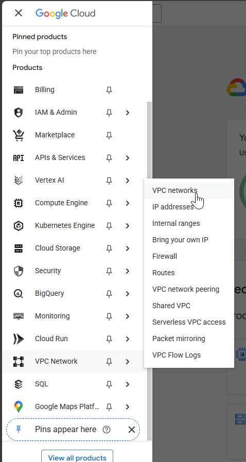    

3. **Click “Create VPC Network”**  
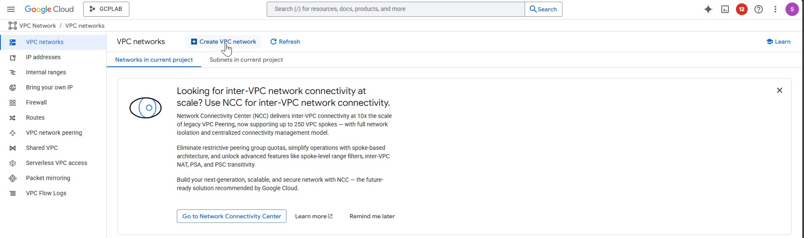   

4. **Enter VPC Name**
   Example: `gcplab-vpc`
5. **Set Subnet Creation Mode**
   Choose `Custom`.

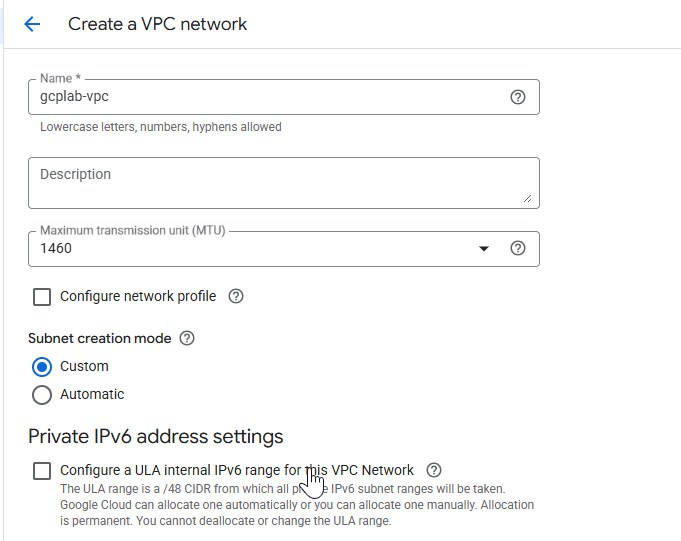 

6. **Add Subnets**
   Click on **Add Subnet** and provide:

   * **Name**: e.g., `subnet-us-central1-ext`
   * **Region**: Choose the region (e.g., `us-central1`)
   * **IP Range**: e.g., `10.0.0.0/24`

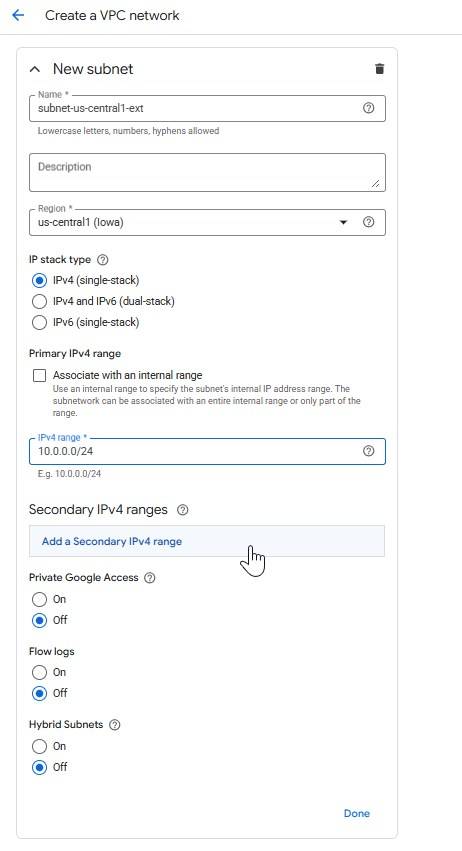 

   You can also add multiple subnets for different regions.

7. **Configure Additional Options (Optional)**

   * Set `Private Google Access` if needed to avoid exposing resources to external network use this, it will not allocate public ip.
   * Configure `Firewall Rules` (you can allow default rules or customize later).

8. **Click “Create”**
   Your custom VPC is now ready.  
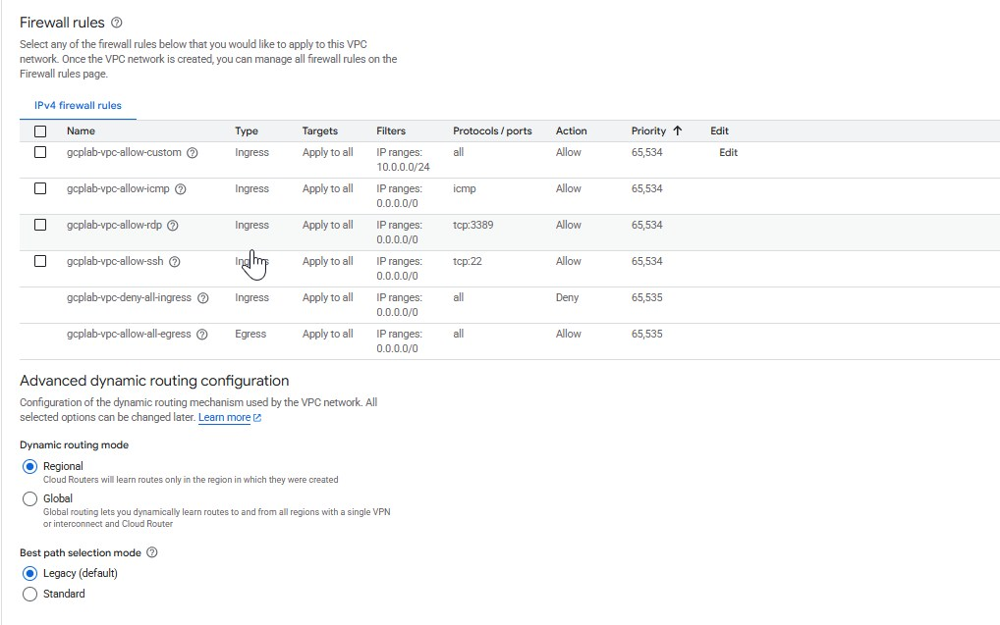 
---

###  Method 2: Using `gcloud` CLI

If you prefer working with the command line, here's how to do it.

#### 0. **Acticate the Cloud Shell**
 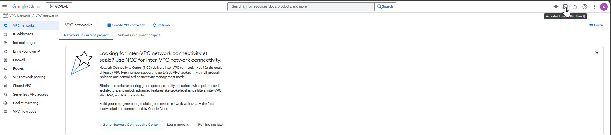 
 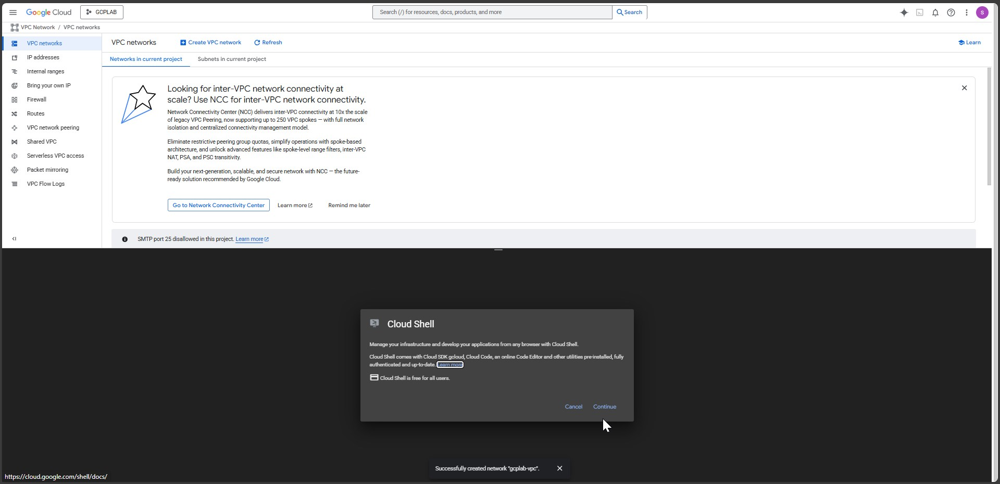 
 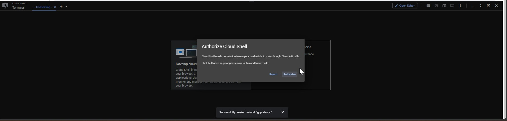 
 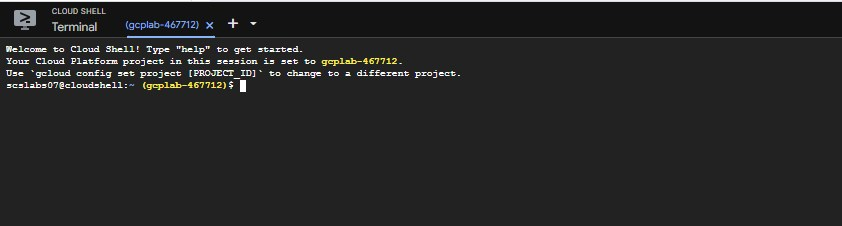 

#### 1. **Create the VPC**

```bash
gcloud compute networks create my-custom-vpc \
    --subnet-mode=custom
```  
 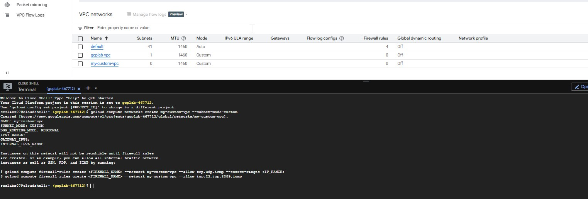   

#### 2. **Create a Subnet**

```bash
gcloud compute networks subnets create subnet-us-central1 \
    --network=my-custom-vpc \
    --region=us-central1 \
    --range=10.1.0.0/24
```  
 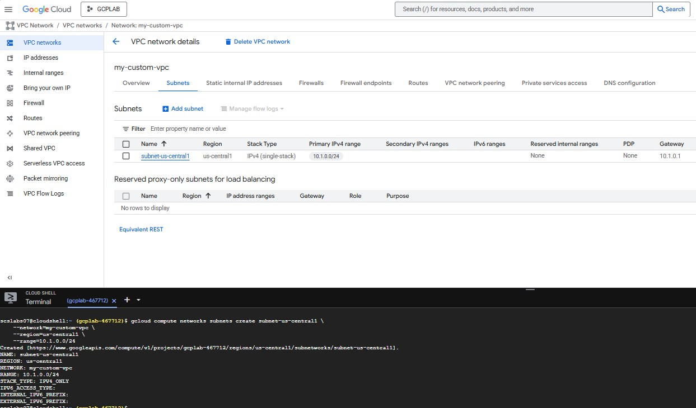

You can repeat this command to create more subnets in other regions.

#### 3. **(Optional) Create Firewall Rules**

Allow SSH, ICMP, and RDP:

```bash
gcloud compute firewall-rules create allow-ssh-icmp-rdp \
    --network=my-custom-vpc \
    --allow=tcp:22,tcp:3389,icmp
```
 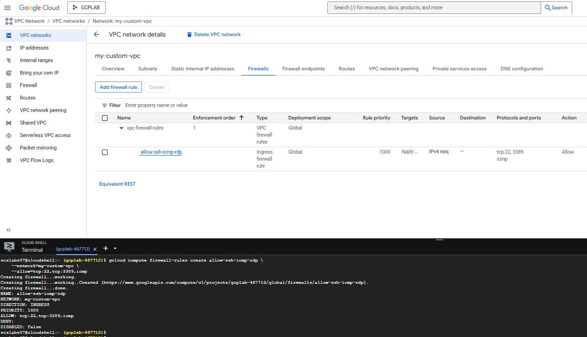
---

##  Best Practices

* Use **private subnets** and **Cloud NAT** for outbound access.
* Avoid using **default VPC** for production workloads.
* Use **firewall tags** or **service accounts** to restrict access.

---

## Conclusion

Setting up a VPC is a critical first step when building infrastructure in GCP or in any Cloud. By creating a **custom VPC**, you ensure greater control, scalability, and security over your cloud environment. Whether you use the console or CLI, the process is straightforward and sets the foundation for your cloud architecture.

---

