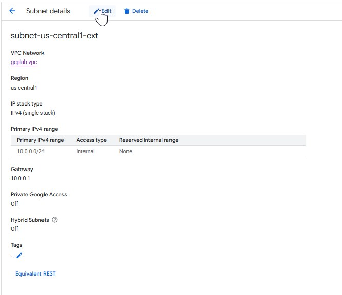
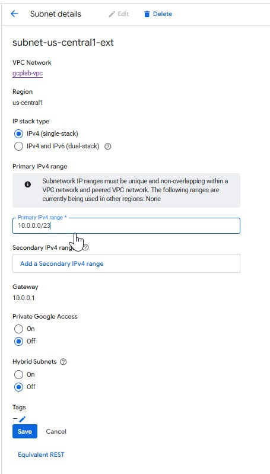
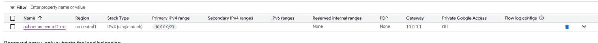

# How to Extend a Subnet in Google Cloud Platform (GCP): Step-by-Step with Restrictions

As your cloud infrastructure grows, you may run out of available IPs in a subnet. In such cases, **extending a subnet’s IP range** is a practical solution — but in Google Cloud Platform (GCP), it must be done carefully and within specific limitations.

This guide walks you through how to **extend a subnet in GCP**, and highlights the **restrictions you need to be aware of** before attempting it.

---

## What Does "Extending a Subnet" Mean?

Extending a subnet means **increasing the IP address range** of an existing subnet to allow more resources (VMs, services) to be deployed without running into IP exhaustion.

> **Example:**
> **Original range**: `10.0.0.0/24` (256 IPs)
> **Extended to**: `10.0.0.0/23` (512 IPs)

---

## Prerequisites

* Subnet must be in **custom mode VPC** (not auto mode).
* You must have permissions: `Compute Network Admin` or equivalent.
* The **new IP range must not overlap** with any other subnet in the same VPC.

---

## Restrictions and Limitations

Before proceeding, here are key **restrictions**:

| Restriction                   | Details                                                                                         |
| ----------------------------- | ----------------------------------------------------------------------------------------------- |
| 🔁 **No shrinking**           | You can **only increase** the subnet size. Reducing the IP range is not supported.              |
| 🧱 **No overlapping ranges**  | The new (larger) CIDR range must not overlap with any existing subnet in the VPC.               |
| 🌍 **Same region**            | You can only extend subnets **within the same region** where they were created.                 |
| ⚠️ **In-use IPs must remain** | All current allocated IP addresses must be within the new range.                                |
| 🕹️ **Only primary IP range** | You can only extend the **primary IP range**, not secondary ranges (used for alias IPs or GKE). |

---

## 🔧 How to Extend a Subnet in GCP

### 📍 Method 1: Using the GCP Console

1. **Go to VPC networks**
   [https://console.cloud.google.com/networking/networks](https://console.cloud.google.com/networking/networks)

2. **Select the VPC containing your subnet and select the subnet**

3. **Click on “Edit” next to the subnet** you want to extend.
 
4. **Update the IP range**
   Example: Change from `10.0.0.0/24` → `10.0.0.0/23`
   

5. **Click Save**

If the new range is valid and does not overlap with other subnets, the change will be applied.  
 
---

### 💻 Method 2: Using `gcloud` CLI

```bash
gcloud compute networks subnets expand-ip-range subnet-us-central1 \
    --region=us-central1 \
    --prefix-length=23
```


Or explicitly specify the new range:

```bash
gcloud compute networks subnets expand-ip-range subnet-us-central1 \
    --region=us-central1 \
    --ip-range=10.0.0.0/23
```

---

## Verifying the Change

After updating the subnet, you can verify the new range:

```bash
gcloud compute networks subnets describe subnet-us-central1 \
    --region=us-central1
```

You should see the updated `ipCidrRange` in the output.

---

##  Best Practices

* Always **back up or export** your current VPC and subnet configurations before making changes.
* Extend only when **IP utilization** is nearing the limit.
* Consider **VPC Peering** or **Secondary Ranges** for scaling without affecting existing subnets.

---

## Summary

Extending a subnet in GCP is a safe and supported operation when:

* You increase the IP range (never reduce it).
* Avoid overlapping with existing ranges.
* Work within the same region and VPC.

By following the right steps and understanding the limitations, you can scale your network confidently without service interruption.

---
