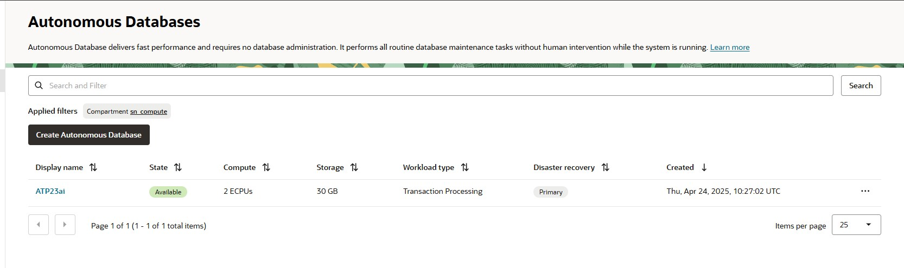

# How to Scale Up and Scale Down CPU and Storage in Oracle Autonomous Database (ADB)
## Introduction
Oracle Autonomous Database (ADB) is designed to be elastic — allowing you to scale compute and storage resources up or down based on workload demands. This dynamic scaling ensures optimal performance and cost efficiency without service interruption.

In this blog, we’ll walk you through how to scale compute (CPU cores) and storage for both Autonomous Data Warehouse (ADW) and Autonomous Transaction Processing (ATP) on Oracle Cloud Infrastructure (OCI) and using the Console, CLI.

### Prerequisites
Before you begin, ensure the following:

* OCI Account Access
    * You have an OCI account with a user assigned to a group with permissions to manage autonomous-database-family.
    * You know the compartment and ADB instance name.

* Tools (Optional)
    * Access to the OCI Console
    * Or OCI Cloud Shell with CLI configured

### Detailed Steps
* **Option 1: Scaling via OCI Console**
    * Sign in to the OCI Console.
    * Navigate to: Oracle Database → Autonomous Databases.  
      
    * Click the name of your ADB instance (ADW or ATP).  
      
    * In the "More Action" section, click "Manage resource allocation".  
    * Modify:
        * OCPU Count: Increase or decrease as needed (e.g., from 2 to 4).
        * Storage (TB): Increase only (cannot decrease storage).  
      
      
    * Click **Apply** Changes.  
      
> ✅ The changes are applied without downtime. Scaling compute is immediate; storage changes may take a few minutes.

*  **Option 2: Scaling Using OCI CLI**  
    You can use the oci db autonomous-database update command.  
    Example: Scale up to 4 OCPUs and 50 GB storage  
    ```
    oci db autonomous-database update --autonomous-database-id ocid1.autonomousdatabase.oc1.phx.anyhqljtzjgvoqyakvw6rksndubgakfcgwfmwsl7gn4ylvpryf6touf3xz2q --compute-count 4 --data-storage-size-in-gbs 50
    ```
      
      

    Example: Scale down to 2 OCPUs and 30 GB storage
    ```
    oci db autonomous-database update --autonomous-database-id ocid1.autonomousdatabase.oc1.phx.anyhqljtzjgvoqyakvw6rksndubgakfcgwfmwsl7gn4ylvpryf6touf3xz2q --compute-count 2 --data-storage-size-in-gbs 30
    ```
      
      


## Best Practices
* 🔁 **Enable Auto Scaling**: Let Oracle manage CPU up/down automatically based on workload.
    * In Console: Edit → Enable Auto Scaling.
* 🕒 **Monitor Resource Usage**: Use ADB metrics and logs in OCI Monitoring to forecast needs.
* 🔐 Use **IAM Policies** to restrict who can scale production ADBs.
* ⏱️ **Avoid frequent manual scaling** — use auto-scaling or schedule scaling during peak/off-peak hours.
* 📊 **Track scaling events** in ADB Activity Logs or via CLI audit logs.

## Conclusion
Scaling Oracle Autonomous Database is fast, flexible, and non-disruptive. Whether you're optimizing for performance during peak hours or minimizing cost during low usage, OCI makes it easy to adjust your ADB resources. With multiple options — Console, CLI — you can choose the best fit for your automation or operations workflow.