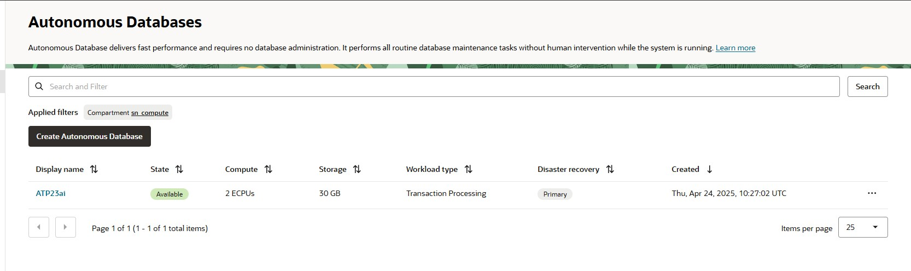

# Starting and Stopping Autonomous Data Warehouse (ADW) in Oracle Cloud Infrastructure

## Introduction
Managing costs and optimizing resource usage are key benefits of running databases in the cloud. Oracle Autonomous Data Warehouse (ADW) allows you to start and stop the database instance on demand, which helps you control spend and run environments only when needed.

This blog covers how to start and stop an ADW instance in Oracle Cloud Infrastructure (OCI) using the Console, OCI CLI.

## Prerequisites
Before you can start or stop an ADW database, make sure:
* You have an OCI user account with permission to manage Autonomous Databases.
* You know the OCID or display name of your target database instance.
* Your ADW database is not using the Always Free tier, as it cannot be manually stopped.
* For CLI/API access:
* OCI CLI is installed and configured
* API keys are registered if using REST API

## IAM Policy required:
```
    Allow group <group-name> to manage autonomous-database-family in compartment <compartment-name>
```

### Step-by-Step Guide
* Option 1: Start/Stop via OCI Console
✅ To Stop the ADW Instance:
    * Log in to the OCI Console.
    * Go to Oracle Database > Autonomous Data Warehouse.
    
    * Select the database you want to stop.

Click the “Stop” button.

Confirm the action.