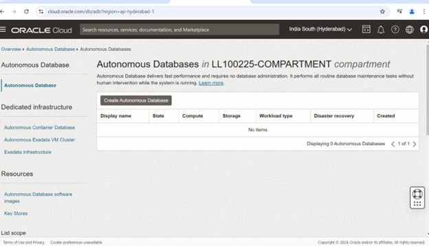
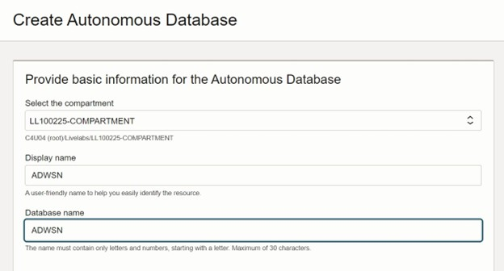
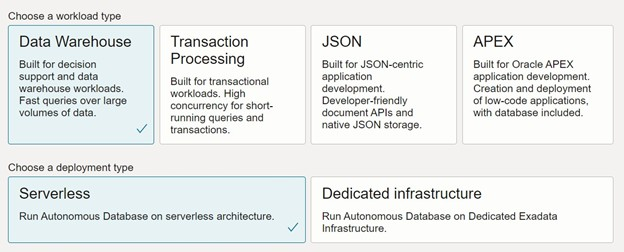
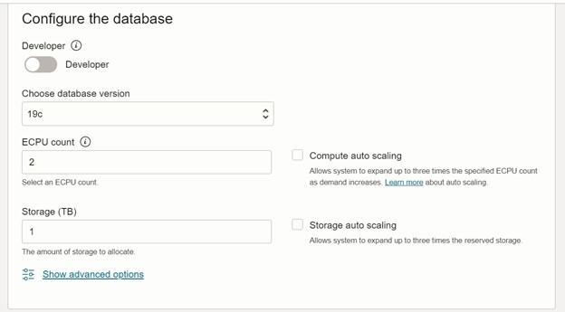
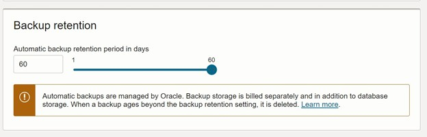
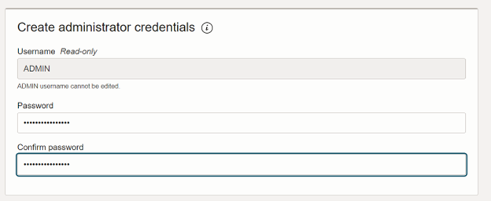
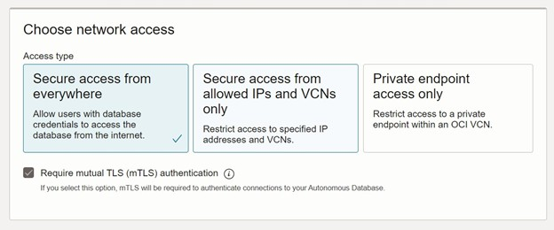
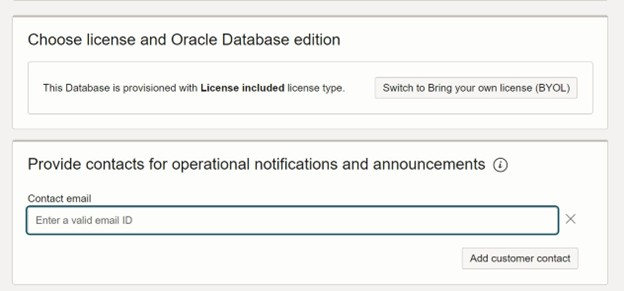

# Deploying Autonomous Data Warehouse (ADW) in Oracle Cloud Infrastructure: A Step-by-Step Guide

## Introduction
Oracle Autonomous Data Warehouse (ADW) is a fully managed, elastic, and self-tuning data warehouse service in Oracle Cloud Infrastructure (OCI). With ADW, you get the power of Oracle Database combined with the simplicity of a cloud-native experience — no manual patching, tuning, or backups required.

In this blog post, we'll guide you step-by-step on how to provision an ADW instance in OCI, along with best practices to ensure a smooth and secure setup.

## Prerequisites
Before you start deploying your ADW instance, ensure the following:

* OCI Account and Permissions
    * A valid OCI tenancy and user account
    * Permissions to create databases, networks, and secrets (OCI policies must be in place)
    * Access to OCI Console and Cloud Shell (optional)

* Required Resources
    * A Virtual Cloud Network (VCN) (can use default)
    * An OCI Compartment to organize your resources
    * An optional Object Storage bucket if you plan to load or export data

Example Required Policies:
These policies are granular one which can be more restricted at compartment level or specific resource level.

```
Allow group <group-name> to manage autonomous-database-family in compartment <compartment-name>
Allow group <group-name> to manage virtual-network-family in compartment <compartment-name>
Allow group <group-name> to manage vaults in compartment <compartment-name>
Allow group <group-name> to manage secret-family in compartment <compartment-name>
```
If all the resources are pre-created by other team , use **use** instead of **manage**:
```
Allow group <group-name> to use virtual-network-family in compartment <compartment-name>
Allow group <group-name> to use vaults in compartment <compartment-name>
Allow group <group-name> to use secret-family in compartment <compartment-name>
```

**Notes**:
* Replace <group-name> with the name of your IAM group (e.g., DBAdmins).
* Replace <compartment-name> with your actual OCI compartment.
* Always follow least privilege: grant only the permissions needed.

### Navigate to Autonomous Database
1. In the OCI Console, open the menu ≡.  
2. Go to Oracle Database → Autonomous Data Warehouse.

### Create Autonomous Data Warehouse
Click **Create Autonomous Database**, then provide the following:  
  
* Compartment: Select where the resource should reside.
* Display Name: e.g., adw-sales-2025
* Database Name: Must be 14 characters or less.  
  
* Workload Type: Choose Data Warehouse
* Deployment Type: Shared Serverless Infrastructure (or Dedicated, if required)  
  
* OCPU & Storage: Set compute and storage size (can auto-scale if needed)
* Auto Scaling: Enable if you want it to scale automatically  
  
* Backup Retention Details  
  
* Provide Administrator Credentails  
  
* Choose the required network access type.  
  
* License Type: Choose “License Included” or “Bring Your Own License (BYOL)”  
  
Click “Create Autonomous Database”.  

**Wait for Provisioning**
The status will show as “Provisioning”. Within a few minutes, it will change to “Available”.

**Download Connection Credentials**
Click **“DB Connection”**, then download the wallet zip file. This file contains the secure credentials needed to connect to ADW using tools like SQL Developer or Python.

Save it securely and unzip it on your local machine or client.

**Connect to ADW**
Use any of the following tools:
* SQL Developer
* SQL*Plus
* Python (cx_Oracle or python-oracledb)
* Oracle APEX (if enabled)

Configure your tool using the connection string and credentials from the wallet file. Example tnsnames.ora entries include:
* low
* medium
* high (refers to the resource consumption profile)

## Best Practices
* **Enable Auto Scaling** to handle peak workloads without manual intervention.
* **Use IAM and compartment policies** to restrict access to ADW resources.
* **Rotate admin passwords** periodically and store them securely using OCI Vault.
* **Enable APEX** for lightweight applications and dashboards.
* **Regularly monitor performance and usage** through built-in ADW metrics and Oracle Cloud Monitoring.
* Consider **enabling data guard** if using dedicated infrastructure for high availability.

## Conclusion
Provisioning Oracle Autonomous Data Warehouse on OCI is quick, intuitive, and ideal for analytics workloads. With built-in automation for patching, backup, and performance tuning, ADW allows you to focus on insights rather than infrastructure.

Start your ADW journey today and experience a new level of simplicity and performance in the cloud.