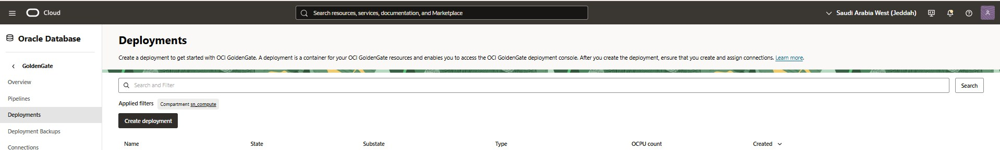
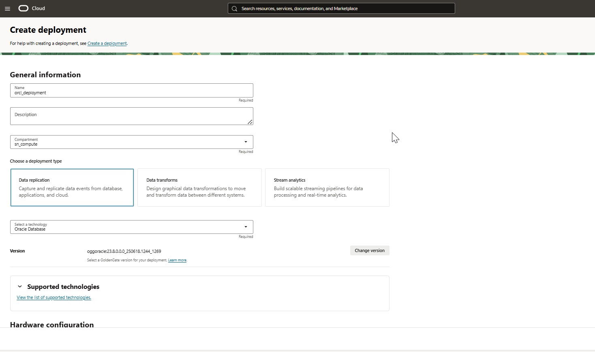
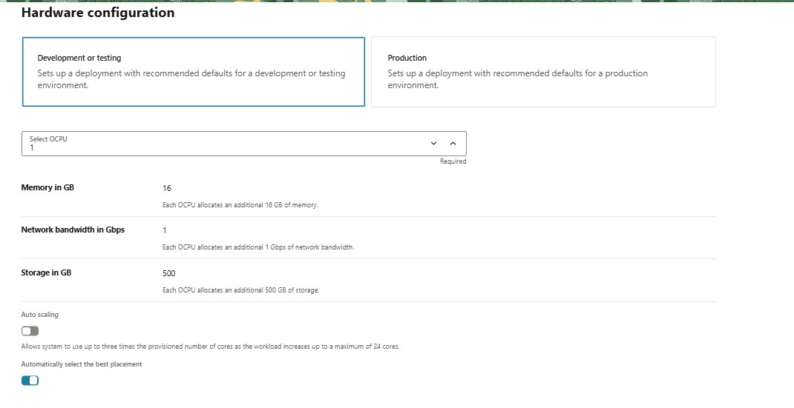
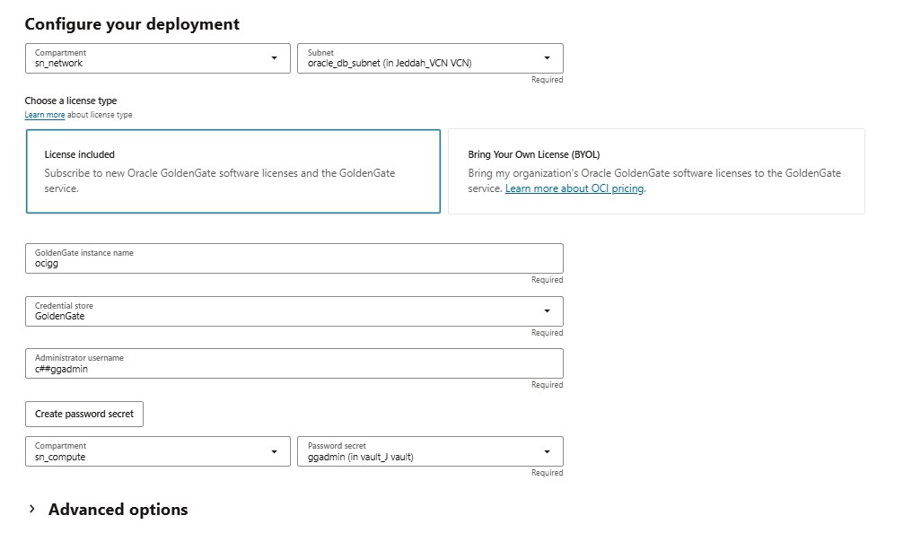
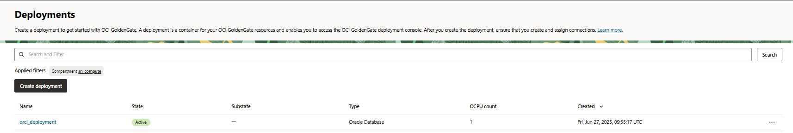
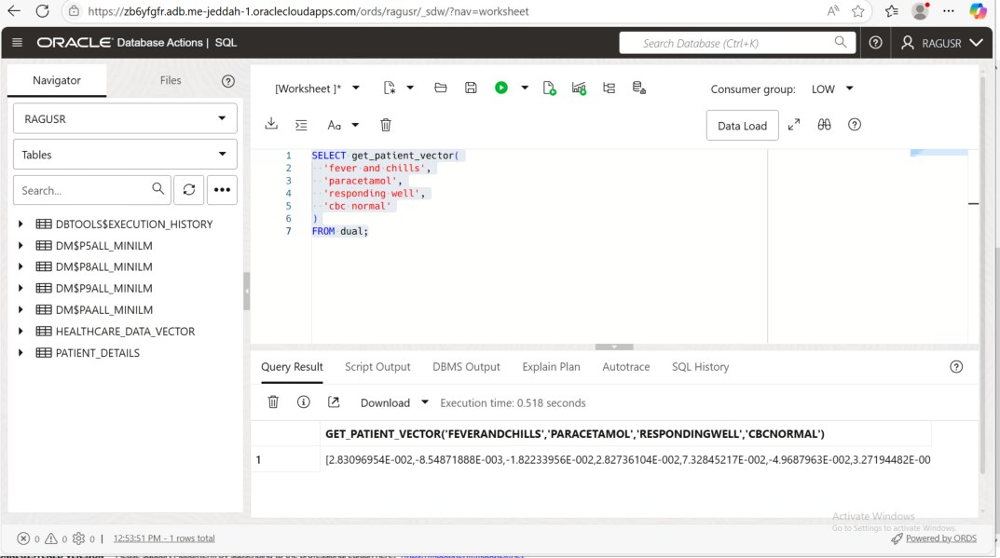

# Real-Time  Data Vectorization Using Oracle GoldenGate and Vector AI

## Introduction
As the healthcare industry shifts towards intelligent systems and real-time decision-making, the ability to derive semantic meaning from patient records becomes essential. In this blog, we’ll demonstrate how to integrate Oracle GoldenGate with Oracle Vector AI to generate patient data embeddings in real time using ONNX-based vector models.

**We'll walk through:**
*   The source and target schema setup
*   Enabling GoldenGate Microservices replication
*   Integrating Oracle Vector AI using VECTOR_EMBEDDING
*   A full end-to-end CDC pipeline that generates embeddings per patient record

## Source and Target Schema
We start with a basic HEALTHCARE_DATA table on a OCI DBCS system source and aim to replicate the data to HEALTHCARE_DATA_VECTOR on Oracle ATP, with one addition — the PATIENT_VECTOR.

```
CREATE TABLE HEALTHCARE_DATA (
    PATIENT_ID      NUMBER(12),
    NAME            VARCHAR2(128),
    AGE             NUMBER(4),
    GENDER          VARCHAR2(26),
    HOSPITAL_ID     VARCHAR2(26),
    HOSPITAL_NAME   VARCHAR2(128),
    LOCATION        VARCHAR2(128),
    DIAGNOSIS       VARCHAR2(128),
    SYMPTOMS        VARCHAR2(128),
    MEDICATIONS     VARCHAR2(128),
    DOCTOR_NOTES    VARCHAR2(256),
    LAB_RESULTS     VARCHAR2(128)
);
```

## Target Table – Oracle ATP with Vector Column

```
CREATE TABLE HEALTHCARE_DATA_VECTOR (
    PATIENT_ID       NUMBER(12),
    NAME             VARCHAR2(128),
    AGE              NUMBER(4),
    GENDER           VARCHAR2(26),
    HOSPITAL_ID      VARCHAR2(26),
    HOSPITAL_NAME    VARCHAR2(128),
    LOCATION         VARCHAR2(128),
    DIAGNOSIS        VARCHAR2(128),
    SYMPTOMS         VARCHAR2(128),
    MEDICATIONS      VARCHAR2(128),
    DOCTOR_NOTES     VARCHAR2(256),
    LAB_RESULTS      VARCHAR2(128),
    PATIENT_VECTOR   VECTOR(*, *, DENSE) -- Dimensions defined by model
);

```

## GoldenGate Microservices Configuration

Deploy Goldengate deployment in oci console.

  
 
 
   
   

## Database preparation for goldengate
### SOURCE DB:
```
ALTER SYSTEM SET enable_goldengate_replication=TRUE;
ALTER SYSTEM SET streams_pool_size=1g;
ALTER DATABASE FORCE LOGGING;
ALTER DATABASE ADD SUPPLEMENTAL LOG DATA;

CREATE USER c##ggadmin IDENTIFIED BY <password> CONTAINER=ALL;
GRANT CONNECT, RESOURCE, CREATE VIEW, CREATE TABLE TO c##ggadmin CONTAINER=ALL;
GRANT SELECT ANY DICTIONARY TO c##ggadmin CONTAINER=ALL;
EXEC DBMS_GOLDENGATE_AUTH.GRANT_ADMIN_PRIVILEGE('c##ggadmin', 'CAPTURE', 'ALL');

```

### Enabling Oracle Vector AI for db user (RAGUSR):
**step 1 Privilleges on target database for vector embeddings**
```
GRANT CREATE MODEL TO ragusr;
GRANT EXECUTE ON DBMS_VECTOR TO ragusr;
GRANT DWROLE TO ragusr;

```  
**step 2 Load ONNX Model from Oracle Object Storage**
```
BEGIN
  DBMS_VECTOR.DROP_ONNX_MODEL(model_name => 'ALL_MINILM', force => TRUE);
  DBMS_VECTOR.LOAD_ONNX_MODEL_CLOUD(
    model_name => 'ALL_MINILM',
    credential => 'MY_OCI_CRED',
    uri => 'https://objectstorage.me-jeddah-1.oraclecloud.com/.../all_MiniLM_L12_v2.onnx',
    metadata => JSON('{
      "function":"embedding",
      "embeddingOutput":"embedding",
      "input":{"input":["DATA"]}
    }')
  );
END;
/

```

**List the loaded model** 
```
SELECT model_name, mining_function
FROM user_mining_models
WHERE model_name = 'ALL_MINILM';
```

### **Step 3: Create Embedding Functions  and store procedures:
**Create Embedding Function used in the inital load and CDC insert replicate**
```
CREATE OR REPLACE EDITIONABLE FUNCTION "RAGUSR"."GET_PATIENT_VECTOR" (
  p_symptoms     IN VARCHAR2,
  p_medications  IN VARCHAR2,
  p_doctor_notes IN VARCHAR2,
  p_lab_results  IN VARCHAR2
) RETURN VECTOR
IS
  v_text      VARCHAR2(4000);
  v_vector    VECTOR;
BEGIN
  v_text := COALESCE(p_symptoms, '') || ' '
         || COALESCE(p_medications, '') || ' '
         || COALESCE(p_doctor_notes, '') || ' '
         || COALESCE(p_lab_results, '');

  -- Generate vector using ONNX model
  SELECT VECTOR_EMBEDDING(ALL_MINILM  USING v_text AS data)
    INTO v_vector
    FROM dual;

  RETURN v_vector;
END;
/
```
**VALIDATE FUNCTION:**
```
SELECT get_patient_vector(
  'fever and chills',
  'paracetamol',
  'responding well',
  'cbc normal'
)
FROM dual;
```  
  

**Create Embedding Store Procedure used in the CDC update and delete replicat**
```
CREATE OR REPLACE PROCEDURE "RAGUSR"."UPDATE_PATIENT_VECTOR" (p_patient_id IN NUMBER) AS
BEGIN
  UPDATE HEALTHCARE_DATA_VECTOR
  SET PATIENT_VECTOR = VECTOR_EMBEDDING(
    ALL_MINILM USING (
      SELECT SYMPTOMS || ' ' || MEDICATIONS || ' ' || DOCTOR_NOTES || ' ' || LAB_RESULTS
      FROM HEALTHCARE_DATA_VECTOR
      WHERE PATIENT_ID = p_patient_id
    ) AS data)
  WHERE PATIENT_ID = p_patient_id;
  COMMIT;
END;
/
```

### Real time replication
#### CDC EXTRACT

```
EXTRACT ECDC
USERIDALIAS src_con DOMAIN OracleGoldenGate
EXTTRAIL EC
TABLE RAGUSER.HEALTHCARE_DATA;
```

#### Inital Load Extract
```
EXTRACT INEXT
USERIDALIAS src_con DOMAIN OracleGoldenGate
Extfile  IL
TABLE RAGUSER.HEALTHCARE_DATA;
```

#### Inital Load Replicate
```
REPLICAT RIL1
USERIDALIAS orcl_con DOMAIN OracleGoldenGate
MAP RAGUSER.HEALTHCARE_DATA, TARGET RAGUSR.HEALTHCARE_DATA_VECTOR,
 COLMAP (
    PATIENT_ID     = PATIENT_ID,
    NAME           = NAME,
    AGE            = AGE,
    GENDER         = GENDER,
    HOSPITAL_ID    = HOSPITAL_ID,
    HOSPITAL_NAME  = HOSPITAL_NAME,
    LOCATION       = LOCATION,
    DIAGNOSIS      = DIAGNOSIS,
    SYMPTOMS       = SYMPTOMS,
    MEDICATIONS    = MEDICATIONS,
    DOCTOR_NOTES   = DOCTOR_NOTES,
    LAB_RESULTS    = LAB_RESULTS,
    PATIENT_VECTOR = @DBFUNCTION('RAGUSR.GET_PATIENT_VECTOR(:a8, :a9, :a10, :a11)')
  );

```

#### CDC Replicate for Insert:
```
REPLICAT RCDCI
USERIDALIAS orcl_con DOMAIN OracleGoldenGate
-- captures only inserts
IGNOREDELETES
IGNOREUPDATES

MAP RAGUSER.HEALTHCARE_DATA, TARGET RAGUSR.HEALTHCARE_DATA_VECTOR,
 COLMAP (
    PATIENT_ID     = PATIENT_ID,
    NAME           = NAME,
    AGE            = AGE,
    GENDER         = GENDER,
    HOSPITAL_ID    = HOSPITAL_ID,
    HOSPITAL_NAME  = HOSPITAL_NAME,
    LOCATION       = LOCATION,
    DIAGNOSIS      = DIAGNOSIS,
    SYMPTOMS       = SYMPTOMS,
    MEDICATIONS    = MEDICATIONS,
    DOCTOR_NOTES   = DOCTOR_NOTES,
    LAB_RESULTS    = LAB_RESULTS,
    PATIENT_VECTOR = @DBFUNCTION('RAGUSR.GET_PATIENT_VECTOR(:a8, :a9, :a10, :a11)')
  );
```

#### CDC Replicate for UPDATE, Deletes
```
REPLICAT RCDCUD
USERIDALIAS orcl_con DOMAIN OracleGoldenGate

-- Only apply updates and deletes
IGNOREINSERTS
GETUPDATES
GETDELETES


MAP RAGUSER.HEALTHCARE_DATA, TARGET RAGUSR.HEALTHCARE_DATA_VECTOR,
  COLMAP (
    PATIENT_ID     = PATIENT_ID,
    NAME           = NAME,
    AGE            = AGE,
    GENDER         = GENDER,
    HOSPITAL_ID    = HOSPITAL_ID,
    HOSPITAL_NAME  = HOSPITAL_NAME,
    LOCATION       = LOCATION,
    DIAGNOSIS      = DIAGNOSIS,
    SYMPTOMS       = SYMPTOMS,
    MEDICATIONS    = MEDICATIONS,
    DOCTOR_NOTES   = DOCTOR_NOTES,
    LAB_RESULTS    = LAB_RESULTS
  ),
  SQLEXEC (
    ID vecupd,
    SPNAME RAGUSR.UPDATE_PATIENT_VECTOR,
    PARAMS (p_patient_id = PATIENT_ID)
  );

  ```

## Conclusion
This architecture demonstrates how you can:

*   Seamlessly replicate data from Oracle DBCS Server to Oracle ATP
*   Apply ONNX-based vector embedding models during replication
*   Enrich your data warehouse with real-time semantic vectors


