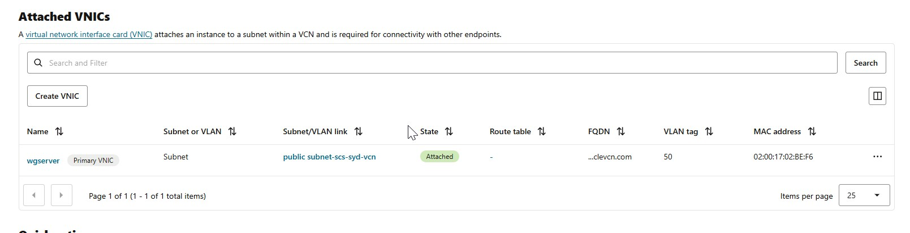
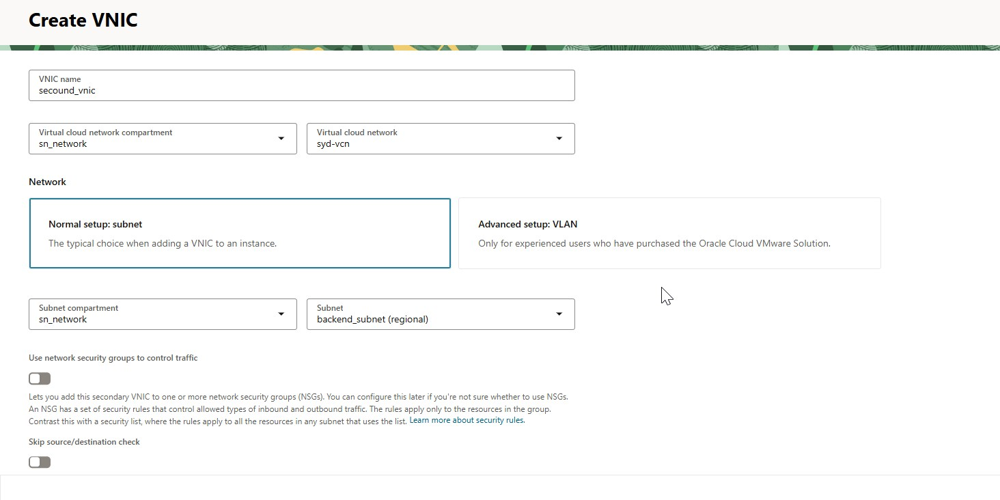
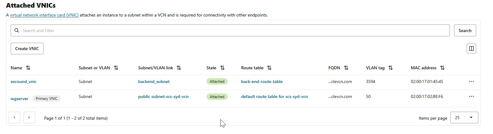

# How to Add Another VNIC to a VM in Oracle Cloud Infrastructure (OCI)

This guide walks you through the process of adding an additional Virtual Network Interface Card (VNIC) to a VM instance in OCI, including setup, OS configuration, and best practices.

---

## Prerequisites

- The VM shape supports multiple VNICs (e.g., `VM.Standard2.1` supports up to 2 VNICs).
- A subnet exists in the same or another VCN.
- Proper IAM permissions to modify compute and network resources.

---

##  Step-by-Step Instructions

### Step 1: Navigate to the VM Instance

1. Sign in to the [OCI Console](https://cloud.oracle.com).
2. Go to **Compute > Instances**.
3. Click on your **instance name**.  
  
---

### Step 2: Attach a New VNIC

1. On the instance details page, scroll to **Resources** > **Attached VNICs**.
2. Click **Create VNIC**.

---

### Step 3: Fill VNIC Details

- **Name:** (Optional) Friendly name for the new VNIC.
- **Subnet:** Choose the subnet (same or different VCN).
- **Private IP Address:** Choose automatic or manual.
- **Public IP:** (Optional) Assign if internet access is needed.
- **Skip Source/Destination Check:** Enable only for advanced routing/NAT setups.
  
  
> Note: For cross-VCN subnets, ensure **VCN peering or routing** is configured.

Click **Submit**.

---

## 🖥️ Step 4: Configure VNIC Inside the VM

After attaching the VNIC:

### SSH into the VM and identify the new interface:

```bash
ip a
sudo nmcli con add type ethernet con-name ens5-static ifname ens5 ip4 10.0.0.50/24 gw4 10.0.0.1
sudo nmcli con up ens5-static
```
