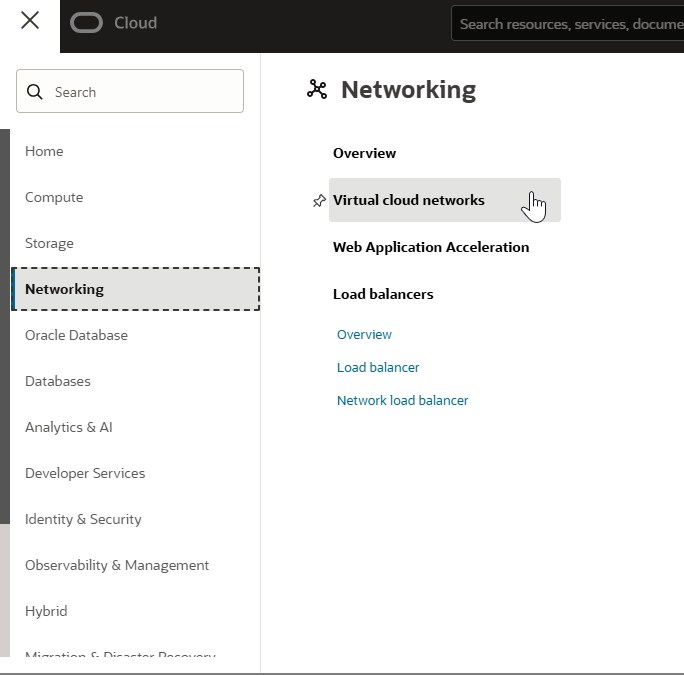
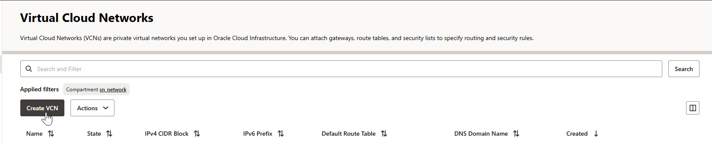
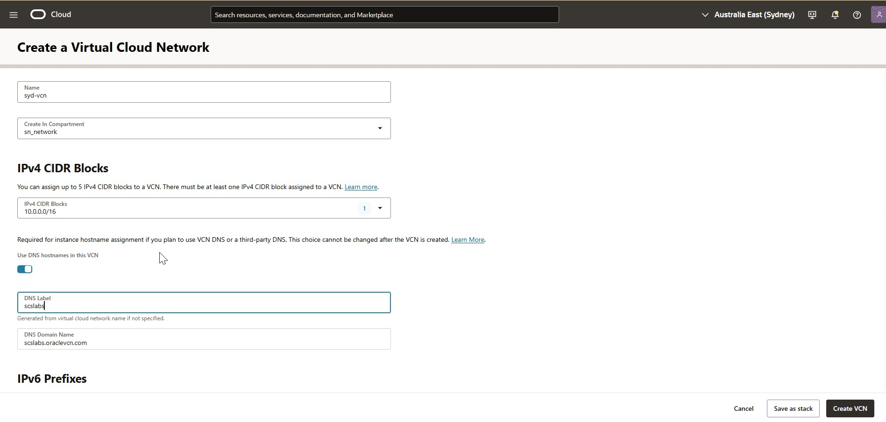
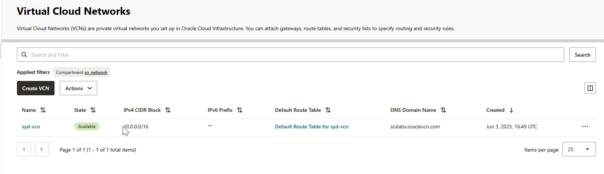

# How to Create a Virtual Cloud Network (VCN) Manually in Oracle Cloud Infrastructure (OCI)

## Introduction
Creating a Virtual Cloud Network (VCN) is one of the fundamental steps when setting up your network infrastructure in Oracle Cloud Infrastructure (OCI). A VCN acts like your private network in the cloud where you can launch and manage your compute instances, databases, and other resources securely.

In this post, we’ll walk you through the step-by-step process to create a VCN manually in OCI using the Console.

## What is a VCN?
A Virtual Cloud Network (VCN) is a customizable private network in OCI. It’s logically isolated from other virtual networks in OCI and provides full control over the network topology, including subnets, route tables, gateways, and security lists.

## Prerequisites
* An active Oracle Cloud Infrastructure account.
* Proper permissions to create networking resources in your OCI tenancy.
* Access to the OCI Console.

### Example IAM Policy for Networking Permissions
```
Allow group NetworkAdmins to manage virtual-network-family in compartment <Compartment Name>
```
## Step-by-Step Guide to Create a VCN Manually
### Step 1: Log in to the OCI Console
* Go to https://cloud.oracle.com
* Sign in with your OCI credentials.

### Step 2: Navigate to Virtual Cloud Networks
* From the Navigation Menu (three horizontal lines on top left), go to:
Networking > Virtual Cloud Networks


### Step 3: Click on “Create Virtual Cloud Network”
* Click the Create Virtual Cloud Network button.


### Step 4: Enter Basic Details  
Name: Enter a friendly name for your VCN (e.g., IN-VCN).  
Compartment: Select the compartment where you want to create the VCN.  
CIDR Block: Specify the IPv4 CIDR block for your VCN (e.g., 10.0.0.0/16). This defines the IP address range available within your network.  
DNS Label: Specify the DNS Label (e.g., scslabs)  

### Step 5: Create the VCN
Click Create Virtual Cloud Network.




## Next Steps After Creating VCN
After creating your VCN, you’ll typically want to:
* Create Subnets (public/private) within your VCN.
* Set up Internet Gateway for public internet access.
* Define Route Tables for traffic routing.
* Configure Security Lists to control traffic in/out of your subnets.

### Additional Tips
* Use RFC 1918 private IP ranges for your CIDR block (e.g., 10.0.0.0/8, 172.16.0.0/12, 192.168.0.0/16).
* Plan your CIDR blocks to avoid overlapping if you plan to connect multiple VCNs or on-prem networks.
* Use compartments to isolate resources logically.

## Summary
Creating a VCN in OCI manually allows you granular control over your cloud networking environment. This flexibility is key for building secure, scalable, and well-organized cloud infrastructure.