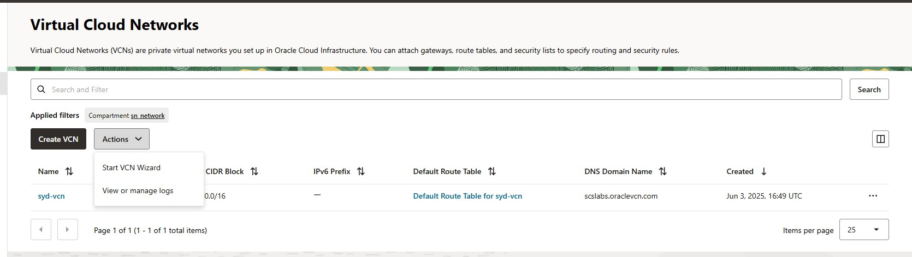

# How to Create a Virtual Cloud Network (VCN) in OCI Using the Wizard

## Introduction:
Oracle Cloud Infrastructure (OCI) provides two main ways to create a Virtual Cloud Network (VCN): manually or using the guided VCN Wizard. The wizard is a quick and beginner-friendly method to launch a full networking setup — including subnets, internet access, and essential routing — all with just a few clicks.

In this blog, you’ll learn how to create a VCN using the built-in wizard from the OCI Console.

**What the VCN Wizard Creates for You**
The VCN Wizard simplifies the process by automatically provisioning:
* A VCN with a default CIDR
* One public subnet
* One private subnet
* An Internet Gateway (for public access)
* A NAT Gateway (for outbound private subnet access)
* A Service Gateway(for communicating with resources using private ips(eg:object storage, ADW)) 
* A Route Table and Security Lists pre-configured

## Step-by-Step Guide to Using the VCN Wizard
###  Step 1: Sign in to OCI Console
Navigate to https://cloud.oracle.com
Log in to your OCI account.

### Step 2: Open the Networking Menu
Click the ☰ Menu (Hamburger Icon) in the top-left corner.
Go to: Networking → Virtual Cloud Networks

### Step 3: Launch the VCN Wizard
Click Start VCN Wizard.  
  

You’ll see two options:
* VCN with Internet Connectivity (Public + Private subnet)
* VCN with Internet Connectivity and Site-to-Site VPN to a VCN
  

Choose VCN with Internet Connectivity for a complete setup if your are planing all resources are in OCI.
Choose VCN with Internet Connectivity and Site-to-Site VPN to a VCN when you want to setup hybrid environment with onprimise and oci cloud.

### Step 4: Fill in the Wizard Form
VCN Name: A friendly name (e.g., scs-syd-vcn)
Compartment: Select where you want to place this VCN.
CIDR Block: set it to 172.16.0.0/16 
Subnet CIDRs will be 172.16.0.0/24 , 172.16.1.0/24 
  
   
###  Step 5: Review and Create
Review all the automatically generated components.
Click Create.
 

### Step 5: Validate VCN.  
  

Once the VCN is create with wizard you will have 2 subnet one is public and one is private subnet.
 

with the vcn 3 gateways will get created.
* Internet Gateway
* Nat Gateway
* Service Gateway  
 

Default Routing rules will be created for all subnets
 

Finally Default Security List will be create for all subnets
 

## Best Practices
* Rename default resources to match your naming convention.
* Avoid using the full /16 CIDR — leave space for future subnets.
* Use Network Security Groups (NSGs) for more flexible firewalling (instead of security lists).
* Monitor traffic and access using VNIC flow logs and Audit logs.
* Access the internet from private instances via NAT Gateway.
* Adjust security list rules to allow traffic on specific ports.

https://orasites-prodapp.cec.ocp.oraclecloud.com/documents/embed/assets/view/CORE25E4D1BD9AF04DC0B3E8606EADF7C40F

I am working in Lift implementation Team and will need access in order to submit intake and see updates on the ticket
submit blog intake and see updates on the ticket
Collaborator