# Using a Custom Domain Name (scslabs.com) in OCI for Internal DNS Resolution

## Introduction
When deploying workloads in Oracle Cloud Infrastructure (OCI), resources are typically assigned default domain names under the oraclevcn.com namespace. While functional, these names are not always intuitive or aligned with organizational naming standards.

In this blog post, I’ll walk through how to configure a custom internal DNS domain (e.g., scslabs.com) within OCI to allow seamless communication between VMs using easy-to-remember, organization domain names.

## Use Case
I have two VCNs in OCI:

syd-vcn (10.0.0.0/16)
scs-syd-vcn (172.16.0.0/16)

Each VCN hosts a VM, and I want to enable them to communicate using FQDNs like:
* vm1.scslabs.com → 10.0.1.144
* vm2.scslabs.com → 172.16.1.197

All traffic is internal, and no public DNS or external IPs are involved.

## Configure Private DNS with Custom Domain in OCI
Oracle Cloud Infrastructure provides Private DNS Zones which allow you to override the default domain and define your own custom namespace — all within your private VCNs.

## Setting Up scslabs.com as a Custom Internal Domain

1.  Create a Private DNS Zone
    1. Go to OCI Console → Networking → DNS Management → Private Zones  
    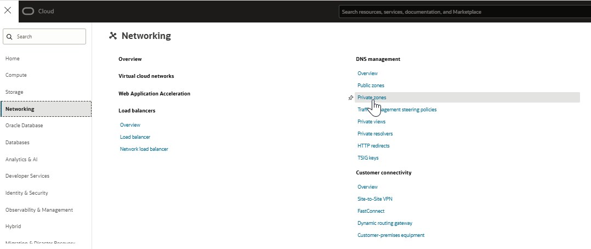 
    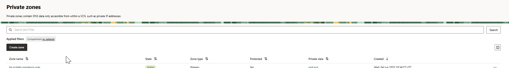  
    1. Click Create Zone
        *   Zone Name: scslabs.com
        *   compartment: (compartment name)
        *   Dns private view: 
            * create new
                *   name: scslabs_pv  

    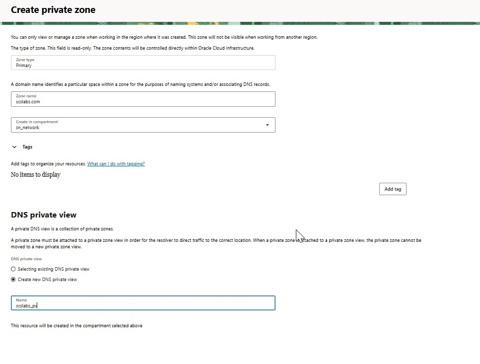  
    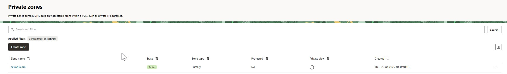 
> This creates an internal-only DNS zone that overrides oraclevcn.com in those VCNs.

1.  Add A Records for Your VMs
    Now define DNS entries that map hostnames to private IP addresses.
    For each VM:
    1.  Go to scslabs.com zone → Records → Manage Records
    2.  Example for VM1:  
      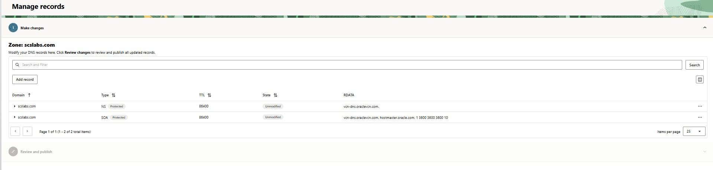   
      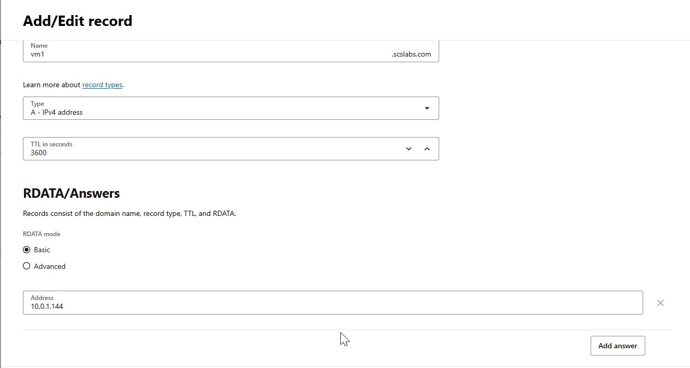  
      once the records are added you will see them as below  
      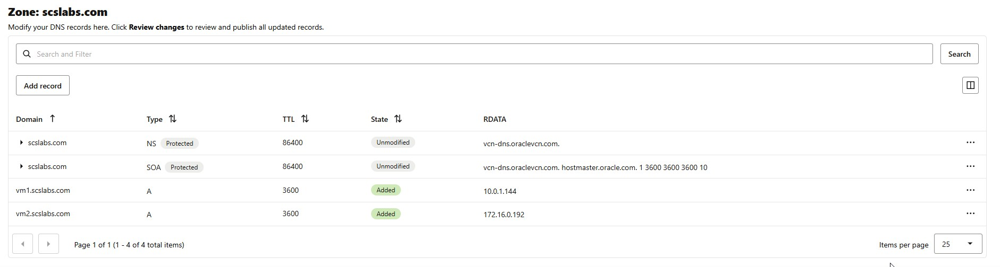  
      review changes and publish changes  
      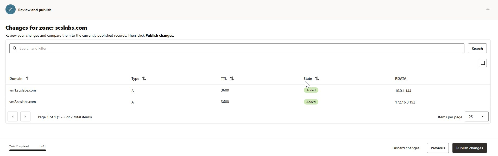  

1.  Update VCN DNS Resolver Settings
    Ensure each VCN uses the custom zone for resolution:
    1.  Go to VCNs → syd-vcn → DNS Resolver  
    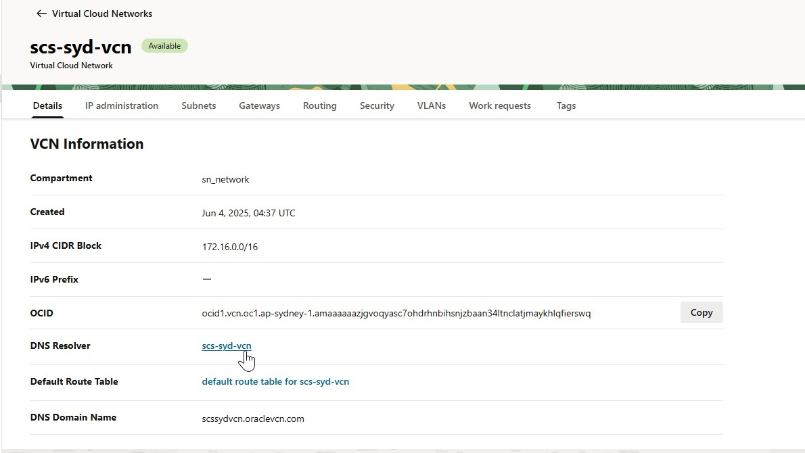  
    1.  Click on Associated private views -> Manage private views
    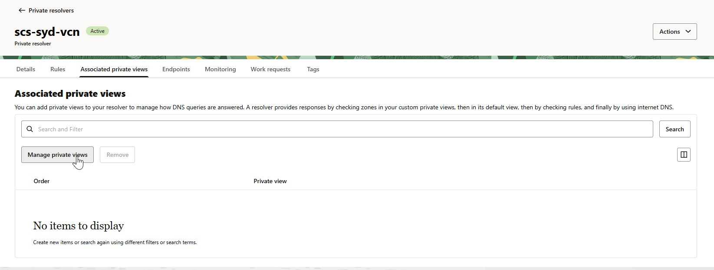   
    1.  Add another private view and select the private view that is associate with private zone.
    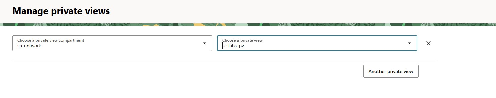  
    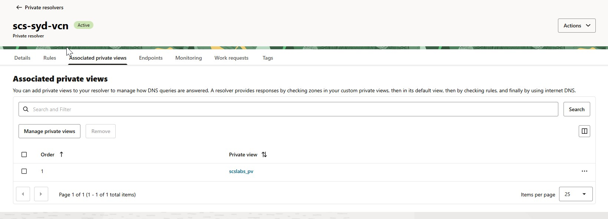 

    **Repeat for scs-syd-vcn**  
    Also ensure that "Enable DNS Hostnames" is checked on the subnet level if needed.


### Optional: Configure Hostnames on the VMs
If you'd like the VMs to respond with FQDNs:  
    ```
    sudo hostnamectl set-hostname vm1.scslabs.com
    ```
1. Test Internal DNS Resolution
    From vm1:
    ```
    ping vm2.scslabs.com
    nslookup vm2.scslabs.com
    ```
    From vm2:
    ```
    ping vm1.scslabs.com
    nslookup vm1.scslabs.com
    ```
You should see responses from the private IP addresses, confirming that DNS resolution is working correctly.

### Best Practices
|Best Practice |	Description |
|:------------|:---------------|
|🔐 Use Private Zones Only	|Keep internal names hidden from the public|
|📒 Consistent Naming |	Follow naming conventions |
|🧪 Test Before Scaling	Confirm DNS works before deploying apps|
