# OCI Networking Learning Path & Practice Tasks
## Phase 1: Foundation - Core Networking Concepts
### Concepts:
- Virtual Cloud Network (VCN)
- Subnets (public/private)
- Route Tables
- Internet Gateway
- Security Lists and NSGs

### Practice Tasks:

### Create a VCN with CIDR block 10.0.0.0/16**

*   Log in to your OCI Console.
*   In the top left corner, open the Navigation Menu → Networking → Virtual Cloud Networks.
*   Click Create VCN.
    *   Fill out the form:
        *   Name: hyd-vcn1 (or your desired name)
        *   CIDR Block: 10.0.0.0/16
        *   Choose the compartment.
        *   Enable or check the option: Use DNS hostnames in this VCN
        *   Rest keep it default 
        *   Click Create VCN.  

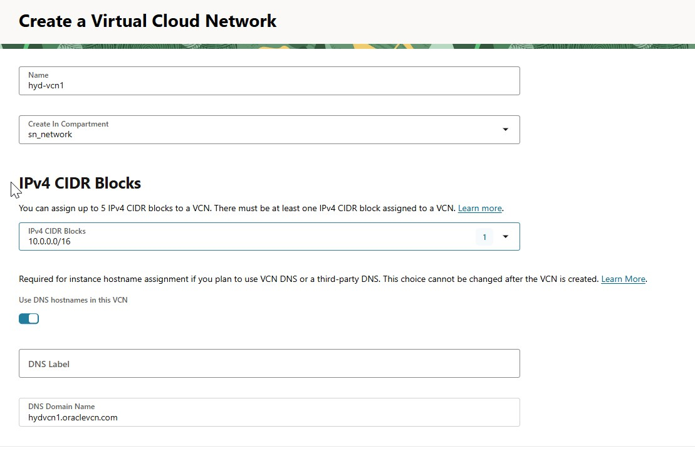  
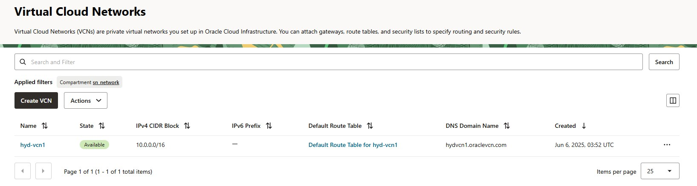  

&nbsp;
 

### Create one public subnet (10.0.1.0/24) and one private subnet (10.0.2.0/24)**

#### Prerequisite:
You must have already created a VCN with CIDR 10.0.0.0/16.

##### Steps:
**Create Public Subnet**
*   Click Subnets → Create Subnet  
*   Name: frontend-Subnet  
*   CIDR: 10.0.1.0/24  
*   Subnet Access: Public Subnet  
*   Route Table:   
*   DHCP Options: Use default  
*   Security List: Use default or custom  
*   Click Create Subnet  

**Create Private Subnet**
*   Click Subnets → Create Subnet
*   Name: backend-Subnet
*   CIDR: 10.0.2.0/24
*   Subnet Access: Private Subnet
*   Route Table: 
*   DHCP Options: Use default
*   Security List: Use default or custom
*   Click Create Subnet

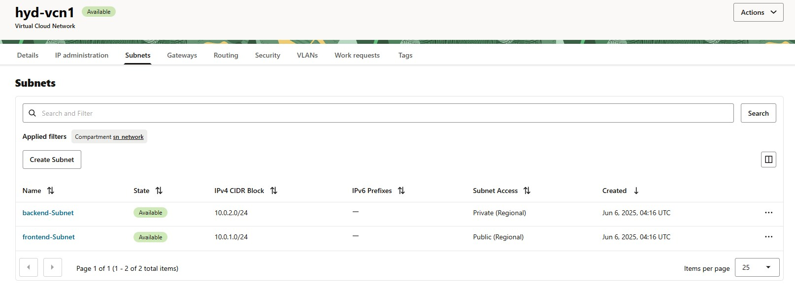  

&nbsp;
 

###  Attach an Internet Gateway, Nat Gateway, Service Gateway to the VCN
Go to your VCN details page (under Networking > VCNs > your VCN).

**Internet Gateways**
*   Under Gateways -> internet gateways -> Create Internet Gateway
    *   Name: IGW
    *   Compartment: Choose the correct Compartment
    *   Create Internet Gateway

**Nat Gateways**
*   Under Gateways -> Nat gateways -> Create NAT Gateway
    *   Name: NAT-GW
    *   Compartment: Choose the correct Compartment
    *   based on the requirment select Ephemeral or reserved public ip
    *   Create Nat Gateway

**Service Gateways**
*   Under Gateways -> Service gateways -> Create Service Gateway
    *   Name: Service-GW
    *   Compartment: Choose the correct Compartment
    *   Services: All <regional> services in Oracle  
    *   Create Service Gateway

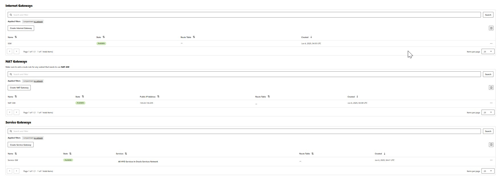  

&nbsp;
 

###  Configure the route rules to route the trafic flow based on the created gateways

#### ROUTE TABLE CONFIGURATION
1.  Route Table for Public Subnet (Public-RT)  
    Internet Gateway  
    Attach this route table to the Public Subnet  

2.  Route Table for Private Subnet (Private-RT)  
    NAT Gateway  
    Service Gateway  
    Attach this route table to the Private Subnet  

**Public-RT**
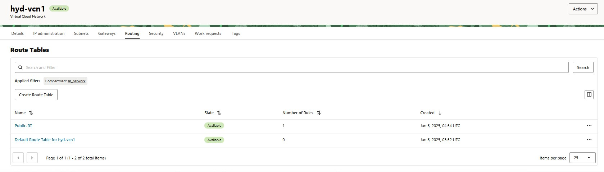  

&nbsp;
 
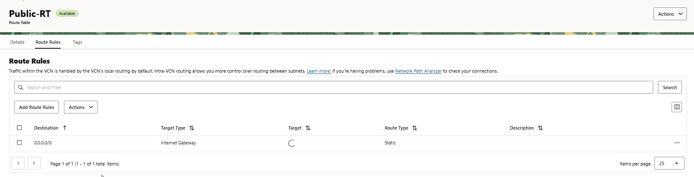  

&nbsp;
 

**Private-RT**  
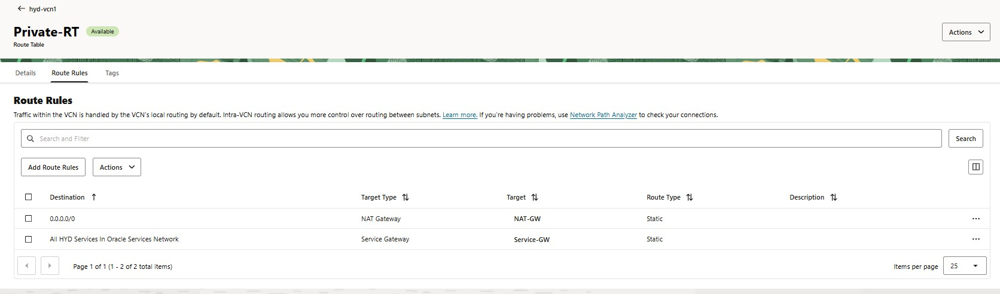  

&nbsp;
 

#### attach route table to subnet
**attaching public RT for frontend subnet**:  
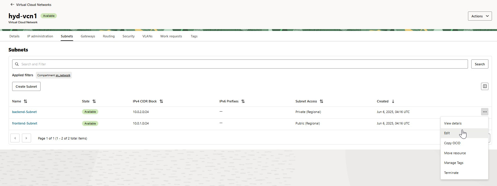  

&nbsp;
 
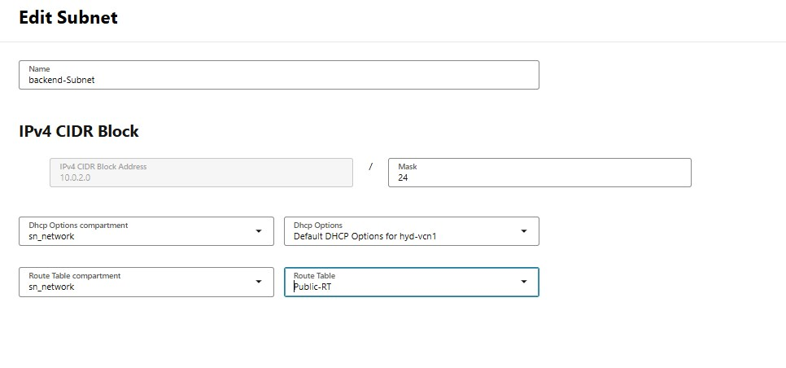  

&nbsp;
 

**attaching private RT for backend subnet**:  
repeat same steps as above  
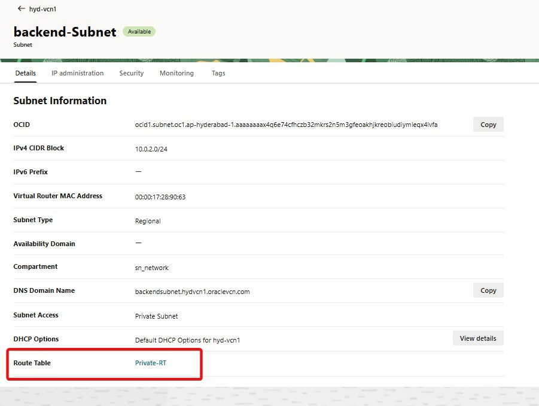  

&nbsp;
 

**Configure required Security list and associate with subnets**
create a security list 
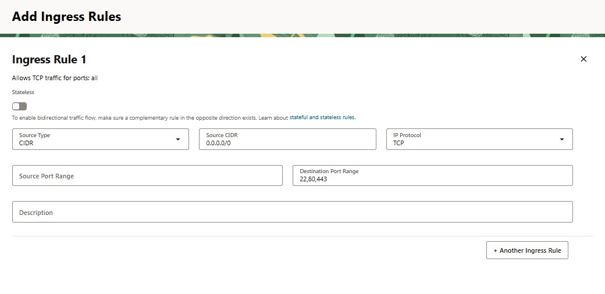 
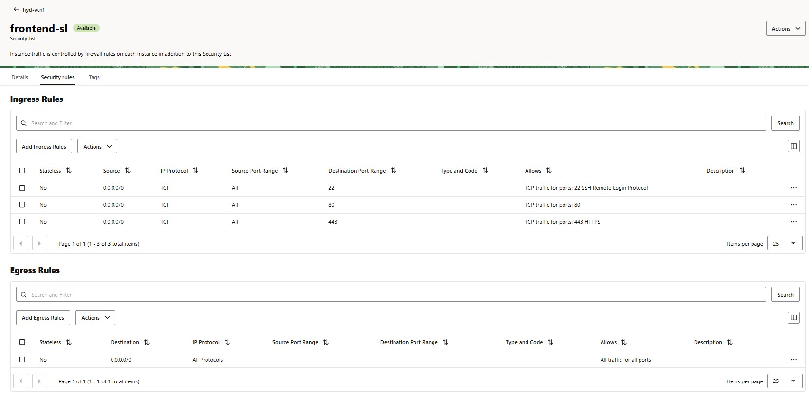 
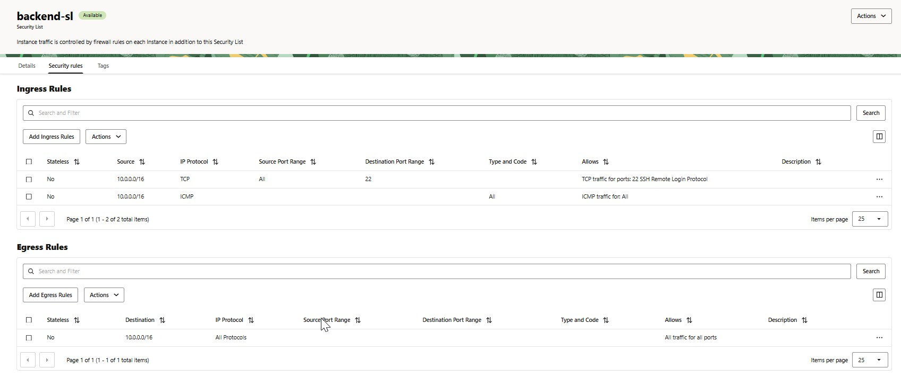

**associate with respective subnets**
remove the default security list and add the required/created security list for public and private subnets.

&nbsp;

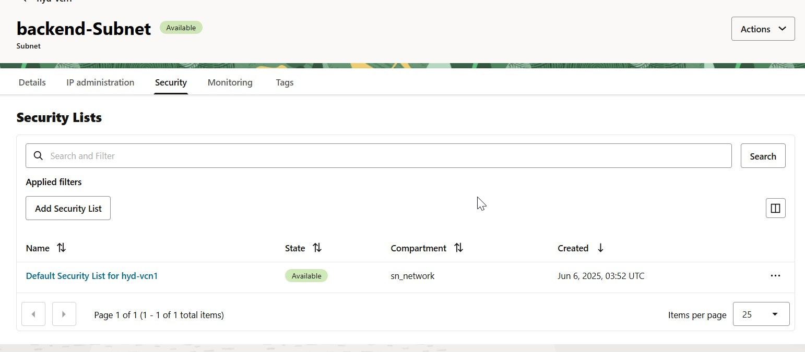
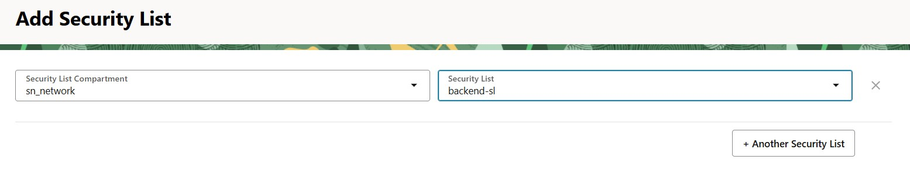
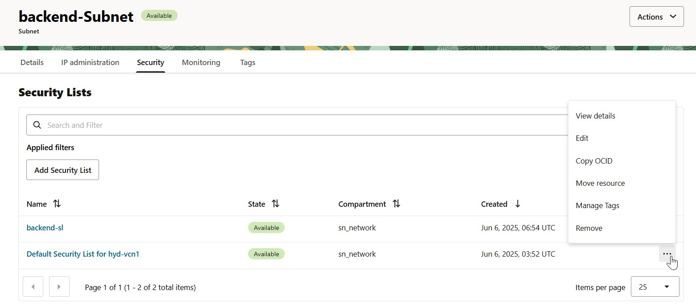
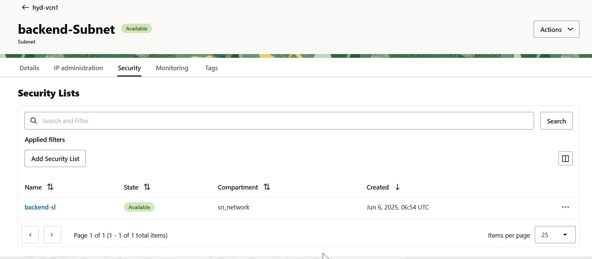

&nbsp;

repeate same steps for other subnets.

### Launch a compute instance in the public subnet with a public IP
i have lunched the vm in public subnet  
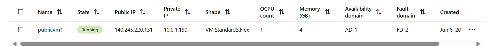

connect to vm and able to ping internet  
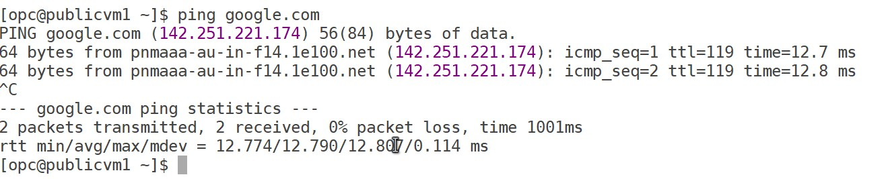
