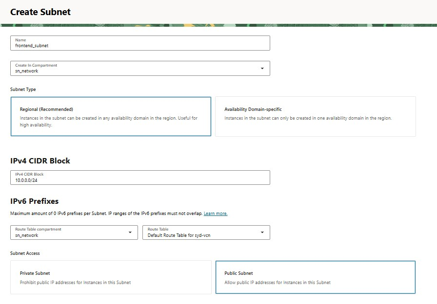
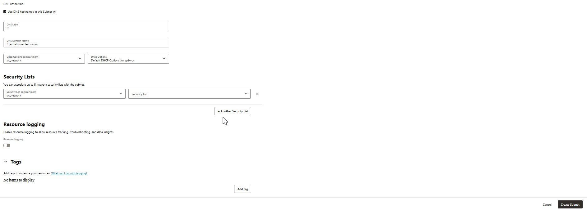
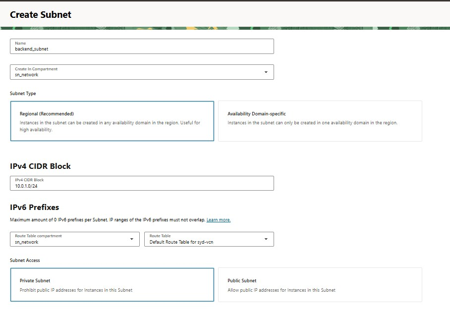
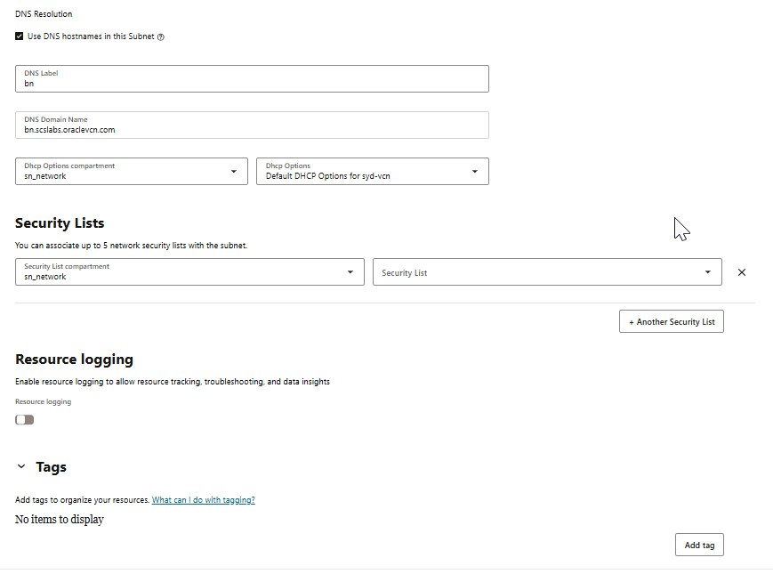

# Steps to Create Subnets in OCI (Oracle Cloud Infrastructure) Manually

# Introduction:
Once you've created a Virtual Cloud Network (VCN) in Oracle Cloud Infrastructure, the next critical step is to segment it using subnets. Subnets help you organize and isolate cloud resources securely and efficiently.

In this blog, you'll learn:
* What a subnet is
* When to use public vs private subnets
* Step-by-step instructions for creating a subnet in OCI
* Best practices for subnet planning

### What is a Subnet in OCI?
A subnet is a range of IP addresses within your VCN (Virtual Cloud Network). You deploy cloud resources like compute instances and databases inside subnets.

Each subnet has:
* A CIDR block (IP range)
* A scope (regional or AD-specific)
* A route table
* A security list or NSG
* Optional DHCP options

## Step-by-Step: Create a Subnet in OCI
### Prerequisites
* A VCN already created
* Proper IAM permissions to manage networking

#### Step 1: Navigate to the VCN
Go to Networking → Virtual Cloud Networks
Select your target VCN (e.g., MyApp-VCN)

#### Step 2: Open the Subnets Page
Click the Subnets tab under the selected VCN
Click Create Subnet

### Step 3: Fill Out Subnet Details
|Field|	Description|
|:-----|:----------|
|Name	|A clear, meaningful name (e.g., web-subnet)|
|CIDR Block|	IP range, e.g., 10.0.1.0/24|
|Subnet Type|	Choose Public or Private|
|Subnet Access|	Choose Regional (recommended)|
|Availability Domain|	Only used if creating AD-specific subnet|
|Route Table	|Select a route table that defines subnet’s traffic|
|Security List / NSG|	Apply appropriate security rules|
|DHCP Options	|Usually default unless customized|

**creating public subnet**  
  
  

**creating private subnet**  
  
  

> For Private Subnets, ensure the route table sends outbound traffic through a NAT Gateway (not Internet Gateway).

#### Step 4: Create the Subnet
Review your configuration
Click Create Subnet

>You’ll be redirected back to the VCN, where your subnet will appear under the Subnets list.

## Best Practices for Subnet Planning
* Avoid overlapping CIDR blocks between subnets
* Use /24 for general-purpose subnets (256 IPs)
* Reserve lower IPs for gateways and infrastructure
* Use regional subnets for high availability
* Use Network Security Groups (NSGs) over Security Lists for flexibility

## Summary
Creating subnets in OCI is a key step in building secure, scalable cloud environments. Each subnet should be designed with intent: whether it’s public-facing, isolated, or high-security.

By following this step-by-step guide, you can confidently create well-structured subnetworks in your OCI tenancy.

