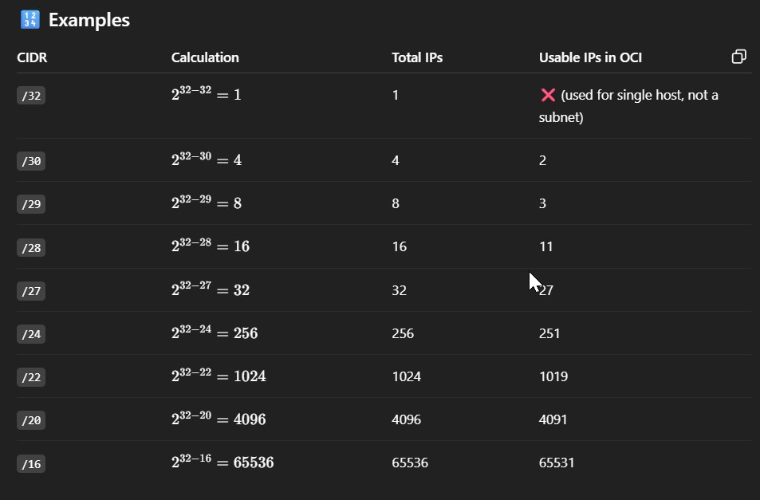

# VCN Addressing using RFC 1918 in OCI

## RFC 1918 — Private IP Addressing
RFC 1918 is a technical standard that defines private IP address ranges for use within private networks, such as internal enterprise LANs, homelabs, and cloud VCNs (like in OCI, AWS, Azure, etc.).

These private IP addresses are not routable on the public internet, which means they cannot directly access or be accessed from the internet without NAT (Network Address Translation).

## Why RFC 1918 Matters
### 1. Internal Communication (Private Networking)
RFC 1918 IPs allow cloud resources to talk privately within a VCN or across VCNs without using public IPs.

**Why it's important**:

* Data between compute, database, and backend services never leaves the cloud’s internal network.
* Reduces cost (no NAT/data egress charges).
* Enhances latency and throughput.

**Example in OCI** :
A private subnet with a DB server (10.0.2.10) receives traffic from a web server in another VCN via a DRG — all over private IPs.

### 2. Security Segmentation (Isolation & Access Control)
Private IPs help you segment your architecture into trust zones:
* Public-facing systems (web)
* Internal business logic (app)
* Sensitive resources (databases)

You can apply different firewall/NACL rules and Network Security Groups (NSGs) at each layer.

**Benefits**:

* Least-privilege access
* Easy auditing and compliance
* No exposure to direct internet traffic

**In OCI** : You can place the web server in 10.0.1.0/24, app layer in 10.0.2.0/24, and DB in 10.0.3.0/24 — and restrict access using NSGs.

### 3. VCN/Subnet Planning (Scalability & Design)
RFC 1918 offers large address pools. You can design subnets based on:

* Teams (Dev, QA, Prod)
* Applications (Web, App, DB)
* Regions or AZs

Because these are non-publicly routable, you can reuse the same IP structures internally across isolated networks.

**Why it matters**:

* Allows easy automation of VCN and subnet creation
* Supports growth (e.g., 10.0.0.0/16 → 65K+ hosts)
* Simplifies DNS naming and DHCP allocation

### 4. Avoiding IP Conflicts (in Hybrid Environments)
When connecting on-prem networks to OCI, overlapping IPs cause routing failures and security issues.
Using unique RFC 1918 blocks across environments ensures:
* Smooth VCN peering
* Seamless IPSec VPN or FastConnect setup
* Proper routing and failover

> Tip: Use well-documented IP planning sheets to ensure no overlaps between:
* On-prem: 192.168.10.0/24
* VCN-1: 10.0.0.0/16
* VCN-2: 172.16.0.0/16

### 5. Isolating Environments (Dev / QA / Prod)
With private IP space, you can build isolated environments inside the same cloud region or tenancy:

|Environment|	CIDR |	Notes |
|:----------|:-------|:--------|
|Dev	| 10.1.0.0/16 |	For testing and CI pipelines|
|QA	| 10.2.0.0/16 |	Used by test automation team |
|Prod |	10.3.0.0/16 |	Production workload only |

Each can:
* Be peered or unpeered based on need
* Use different access control/security policies
* Have separate DNS zones or resolvers

## Key Characteristics
* These ranges must not be routed on the public internet.
* Routers discard traffic with private IP source/destination outside the private network.
* NAT is typically used to allow internet access from these addresses.
* Multiple organizations can use the same private IP ranges without conflict, as long as they’re isolated.

### What’s Not RFC 1918?
Any other IP ranges — like:
* 8.8.8.8 (Google DNS)
* 1.1.1.1 (Cloudflare DNS)
* 203.0.113.0/24 (TEST-NET-3)
These are not private IPs and can be routed on the public internet.

## RFC 1918 Standards in OCI (Oracle Cloud Infrastructure)
In Oracle Cloud Infrastructure (OCI), RFC 1918-compliant IP ranges are used for creating Virtual Cloud Networks (VCNs) and subnets. These ranges form the foundation of private networking in your OCI environment — enabling secure, non-internet-routable communication among your resources like Compute, Database, and Load Balancer instances.

## Use in OCI: How RFC 1918 Applies
### 1. VCN CIDR Blocks
When creating a VCN, Oracle requires that your VCN CIDR block:
* Is within RFC 1918 IP ranges
* Does not overlap with other VCNs or your on-prem network (for peering/hybrid setups)

### 2. Subnet Design
Each subnet inherits a portion of the VCN’s RFC 1918 space. You can choose:
* /30 (4 IPs) for small workloads
* /16 or larger for scalable deployments

### 3. Peering and Hybrid Networking
To connect:
* VCN-to-VCN (Local or Remote Peering)
* VCN-to-On-Premises (via DRG & VPN/FastConnect)

> 👉 Avoid overlapping RFC 1918 ranges — or routing will break!

### 4. DNS and Private Access
DNS resolvers and Private DNS Zones in OCI work within these private IP spaces
Access to services like Object Storage via Service Gateway also uses private IPs only

### 5. Network Security
RFC 1918 ensures isolation from the internet by default. Combine it with:
* Security Lists
* Network Security Groups
* Private Subnets (no public IPs)
* No default Internet Gateway

In Oracle Cloud Infrastructure (OCI), when designing Virtual Cloud Networks (VCNs) and subnets, Oracle imposes specific minimum and maximum CIDR block sizes based on the number of usable IP addresses.

**VCN and Subnet IP Range Limits**
|Resource |	CIDR Block Size Range |	Minimum IPs (/30) |	Maximum IPs (/16)|
|:--------|:----------------------|:----------|:--------------|
|VCN	|/30 to /16	| 4 IPs (2 usable) |	65,536 IPs |
|Subnet	|/30 to /16	| 4 IPs (2 usable) | 	65,536 IPs |

OCI reserves 5 IPs in each subnet:
* First IP – Network address
* Second IP – Reserved for the VCN router
* Third IP – Reserved for DNS
* Fourth IP – Reserved for future use
* Last IP – Broadcast address

# Understand CIDR Notation Basics

CIDR (Classless Inter-Domain Routing) defines:

How many bits are reserved for the network

How many bits are left for hosts (IP addresses)  

|CIDR |	Hosts (Total IPs)|	Usable IPs in OCI |	Example IP Range|
|:----|:-----------------|:-------------------|:----------------|
|/30 |	4 IPs	|2 usable |	10.0.0.0 – 10.0.0.3 |
|/29 |	8 IPs	|3 usable |	10.0.0.0 – 10.0.0.7 |
|/24 |	256 IPs	|251 usable |	10.0.1.0 – 10.0.1.255 |
|/22 |	1024 IPs |	1019 usable |	10.0.0.0 – 10.0.3.255 |
|/16 |	65,536 IPs |	65,531 usable| 	10.0.0.0 – 10.0.255.255 |

> OCI reserves 5 IPs in every subnet (network, broadcast, VCN router, DNS, future use)

CIDR to IP Count Calculation

$$
\text{Total IPs} = 2^{(32 - \text{CIDR mask})}
$$

Example:

**Breakdown Example: /24**

- **CIDR:** /24

- **Host bits:**  
  \[
  32 - 24 = 8
  \]

- **Total IPs:**  
  \[
  2^{8} = 256
  \]

- **Reserved IPs:** 5

- **✅ Usable IPs:**  
  \[
  256 - 5 = 251
  \]

