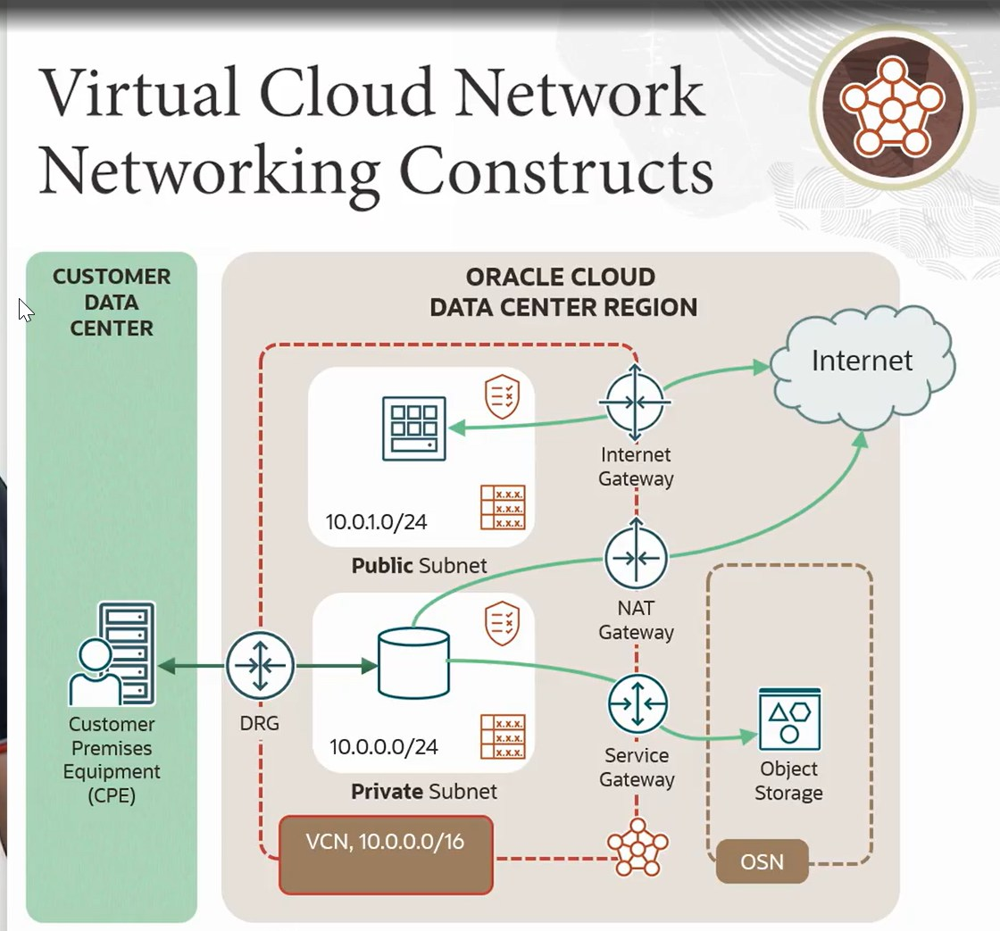

# Introduction to OCI Virtual Cloud Network (VCN)
## What is a VCN?
A Virtual Cloud Network (VCN) in Oracle Cloud Infrastructure (OCI) is a software-defined, private network that closely resembles a traditional data center network. It allows you to launch cloud resources in a secure, isolated environment.

**It provides full control over**:  
* IP address space  
* Subnets  
* Route tables  
* Gateways  
* Security rules  

## Core VCN Architecture

A VCN consists of several key components:
* VCN (Virtual Cloud Network)
* Subnets
* Gateways
    * Internet Gateway
    * NAT Gateway
    * Service Gateway
    * Dynamic Routing Gateway 
    * Local Peering Gateway
* Route Tables
* Security Lists
* Network Security Groups (NSGs)
* DHCP Options
* Private DNS Zones

### 1. VCN (Virtual Cloud Network)
A customizable, isolated network within OCI where you launch cloud resources.
* Similar to an on-premises network
* Must define a CIDR block (e.g., 10.0.0.0/16)
* Spans all Availability Domains in a region

> Use Case: Create a secure environment for compute, storage, and databases.

### 2. Subnet
A logical subdivision of a VCN.
* Can be public or private
* Associated with a route table, security list, DHCP options
* Defines IP range within the VCN CIDR block

> Use Case: Separate frontend (public) and backend (private) tiers in your app.

### Gateways
### 3. Internet Gateway
Enables bidirectional internet access for public subnets.
* Must be explicitly added to a route table
* Only 1 Internet Gateway per VCN

>Use Case: Allow a web server in a public subnet to serve traffic to/from the internet.

### 4. NAT Gateway (Network Address Translation)
Provides outbound internet access for private subnets without exposing instances to inbound connections.
* Must be referenced in a route table
* Replaces the instance’s IP with the NAT’s public IP

> Use Case: Allow internal servers to download OS updates or packages.

### 5. Service Gateway
Enables private access to OCI services (e.g., Object Storage, Autonomous DB) without needing public IPs.
* Traffic stays within OCI’s backbone
* Does not expose instances to the internet

> Use Case: A private compute instance uploads data to Object Storage without a public IP.

### 6. Local Peering Gateway (LPG)
Connects two VCNs in the same region for private, high-speed communication.
* No public internet involved
* Must update route tables and security lists

Use Case: Connect a compute VCN to a database VCN in the same region.

### 7. Dynamic Routing Gateway (DRG)
Connects a VCN to on-premises networks or other VCNs across regions.
* Supports IPSec VPN, FastConnect, Remote VCN Peering, and Transit Routing

> Use Case: Enable hybrid cloud by connecting your on-premises data center to OCI.

### 8. Route Table
A set of rules that defines where to send traffic leaving a subnet.
* Each rule specifies a destination CIDR and a target (IG, NAT, LPG, DRG, etc.)
* Each subnet uses one route table

> Use Case: Route internet traffic to Internet Gateway, or cross-VCN traffic to LPG.

### 9. Security List
A virtual firewall at the subnet level that controls ingress and egress traffic.
* Contains stateful or stateless rules
* Applies to all resources in the subnet

> Use Case: Allow SSH on port 22 and block all other access to a subnet.

### 10. Network Security Group (NSG)
A virtual firewall at the instance level.
* Like AWS Security Groups
* Can group multiple instances across subnets
* More granular and flexible than Security Lists

> Use Case: Allow app servers to talk to DB servers using specific port rules.

### 11. DHCP Options
Defines how instances resolve hostnames to IP addresses in a subnet.
**Options**:
* Use OCI VCN Resolver
* Use a Custom DNS server

> Use Case: Set DNS resolution to internal FQDNs like web.lab.internal.

### 12. Private DNS Zone
A custom domain name space for internal name resolution within VCNs.
* Like mycorp.internal
* Can define A, CNAME, PTR, and TXT records
* Supports view sharing across VCNs

> Use Case: Allow VMs in different VCNs to resolve hostnames like db1.internal.

### 13. DNS View
A container for private DNS zones used for VCN association.
* Automatically created with a private zone
* Must be shared with other VCNs for cross-VCN resolution

> Use Case: Share a lab.internal DNS zone between vcn1 and vcn2.

### 14. Private IP
Each VNIC attached to a compute instance gets a private IP address from its subnet.
* Used for internal communication
* Stays fixed unless manually changed

> Use Case: Internal communication between app and DB servers.

### 15. Public IP
A public-facing IP assigned to an instance or a resource like a load balancer.
* Can be ephemeral or reserved
* Must be associated with a public subnet

> Use Case: Assign a fixed IP to a web server for consistent public access.

### 16. VNIC (Virtual Network Interface Card)
Represents a virtual NIC attached to a compute instance.
* Each VNIC connects to one subnet
* Has a private IP, optional public IP, and NSG associations

> Use Case: Attach multiple VNICs to a VM to place it in multiple subnets.

### 17. Flow Logs (VCN Flow Logs)
Captures network traffic metadata at the VCN level for visibility and troubleshooting.
* Stored in Object Storage
* Integrated with Logging and SIEM tools

> Use Case: Audit inbound/outbound traffic for security and debugging.

### 18. FastConnect
Provides a dedicated private connection from your on-prem data center to OCI.
* Alternative to VPN
* More reliable and with lower latency

> Use Case: High-throughput data transfers between your enterprise network and OCI.

### 19. IPSec VPN
A secure encrypted tunnel between your on-premises network and OCI via public internet.
* Configured on DRG
* Used for hybrid connectivity when FastConnect is not available

> Use Case: Backup path or initial test connection to OCI from your data center.

### 20. VCN Peering
Enables communication between two VCNs using LPG (same region) or DRG (remote region).
* Requires proper routing and security rules
* Used for resource sharing across environments (e.g., Dev ↔ Prod)

> Use Case: App servers in VCN1 access DB servers in VCN2.

Summary of Key Terms

|Term |	Description |
|:----|:-------------|
|VCN	|Isolated virtual network in OCI |
|Subnet	|IP range inside a VCN |
|Route Table |	Defines traffic direction |
|Internet Gateway |	Enables public internet access |
|NAT Gateway |	Enables outbound traffic for private subnets |
|DRG	| Connects on-premises or other regions |
|LPG	| Connects VCNs in the same region |
|NSG	| Instance-level security groups |
|Security List |	Subnet-level firewall |
|DHCP Option |	Sets DNS resolver |
|Private DNS Zone |	Internal domain name resolution |

## Use Cases
* Multi-tier applications (Web, App, DB layers with isolation)
* Hybrid cloud connectivity (via DRG + VPN/FastConnect)
* Cross-VCN communication (LPG/DRG with DNS view sharing)
* Private access to OCI services (Service Gateway)

