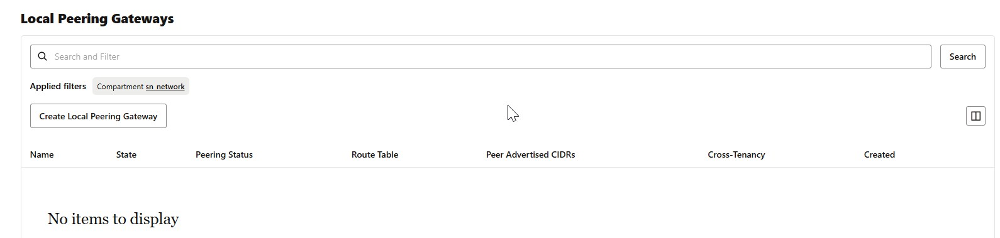
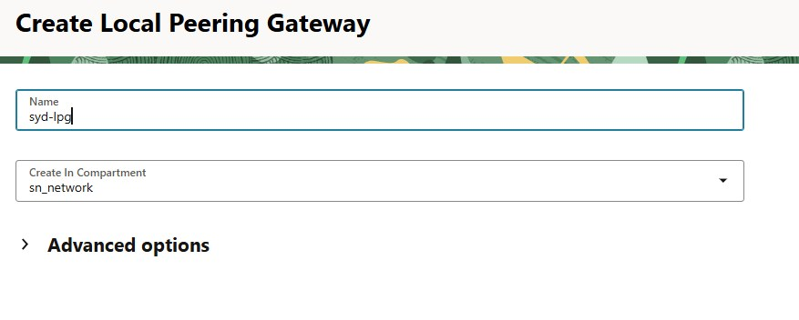
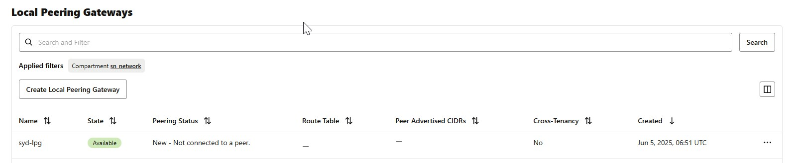
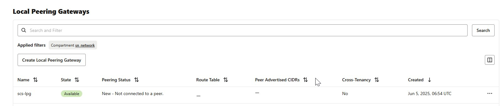
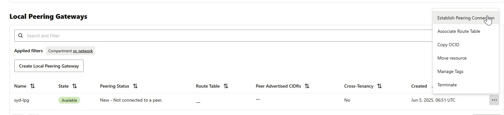
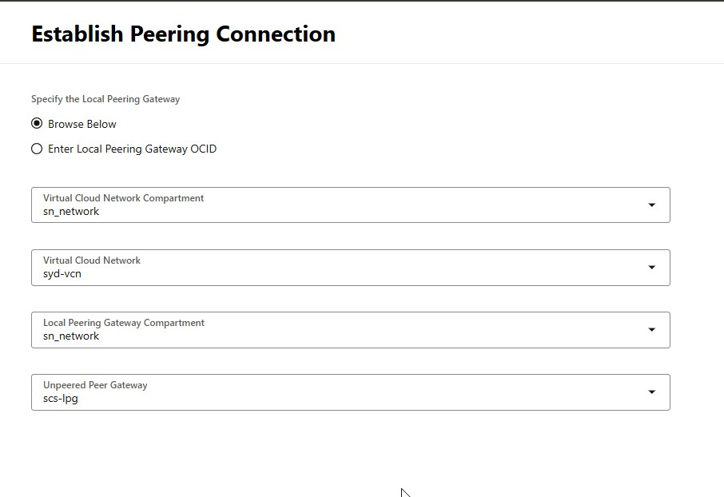
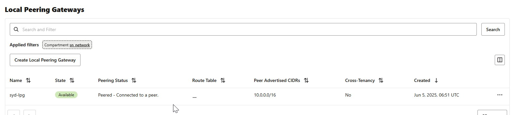
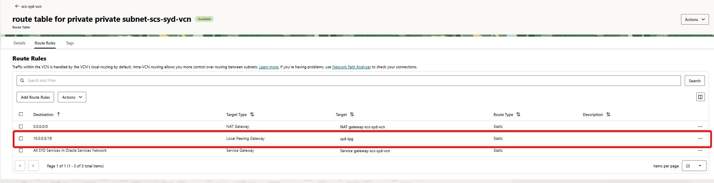
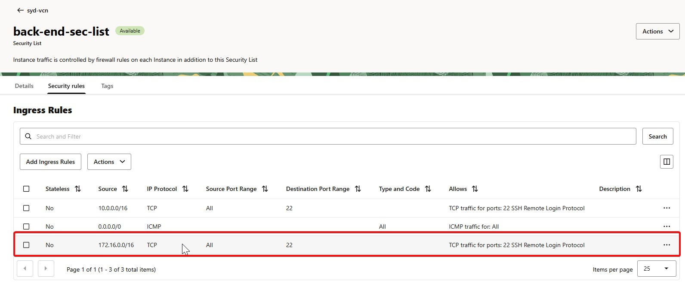
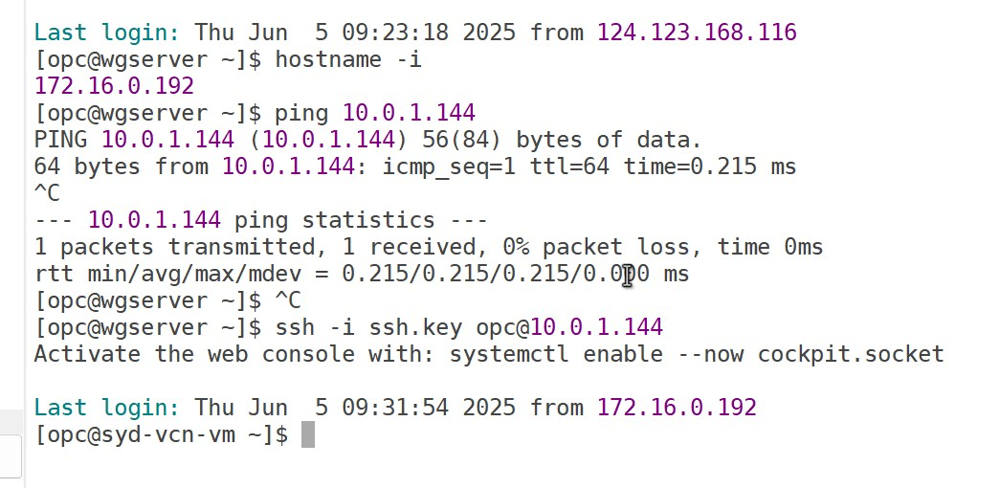

# Enabling Communication Between Two VMs in Separate OCI VCNs Using Local Peering

## Introduction:
In this blog post, we’ll walk through how to establish private network communication between two virtual machines (VMs) residing in separate Virtual Cloud Networks (VCNs) within Oracle Cloud Infrastructure (OCI) in same region. This setup is ideal for scenarios where you logically separate your environments but still require seamless interaction between them.

## Use Case Overview
We have the following setup in OCI - Sydney region:

|VCN Name |	CIDR Block |	VM Subnet	|Purpose|
|:--------|:-----------|:---------------|-------|
|syd-vcn |	10.0.0.0/16	| 10.0.0.0/24|	Application VM|
|scs-syd-vcn |	172.16.0.0/16|172.16.0.0/24|	Database VM|

Each VCN contains a VM in a private subnet. Our goal is to allow these VMs to communicate privately using their internal IPs.

## Solution: Local Peering Gateway (LPG)

OCI provides Local Peering Gateways (LPGs) to enable traffic flow between two VCNs in the same region. This avoids sending traffic over the internet and ensures low-latency, secure connectivity.

## Steps:
1.  Create Local Peering Gateways
    1. In syd-vcn:
        * Navigate to: Networking → Virtual Cloud Networks → syd-vcn → Gateway → Local Peering Gateways
        * Click Create Local Peering Gateway
            * Name: syd-lpg
            * Leave defaults and create  
          
          
         
    1. In scs-syd-vcn:
        * Navigate to: Networking → Virtual Cloud Networks → scs-syd-vcn → Gateway → Local Peering Gateways
        * Click Create Local Peering Gateway
            * Name: scs-lpg  
          

1. Establish Peering Connection
   * Go to one of the LPGs (e.g., syd-lpg)
   * Click Establish Peering Connection
   * Select:
        * Target LPG: scs-lpg
        * Peer Tenancy: Your tenancy
        * Peer Region: Same (Sydney)
   * Confirm the connection — it should show as Active
      
      
      


1.  Update Route Tables  
    Each subnet needs a route to the other VCN via the LPG.    
    a. For Subnet in syd-vcn (e.g., 10.0.0.0/24):  
        * Navigate to the subnet’s Route Table  
        * Add a rule:  
    ```  
        Destination CIDR: 172.16.0.0/16  
        Target Type: Local Peering Gateway          
        Target: syd-lpg  
    ```  
          
        
    
    b. For Subnet in scs-syd-vcn (e.g., 172.16.0.0/24):

    * Add a route rule:
    ```
    Destination CIDR: 10.0.0.0/16
    Target Type: Local Peering Gateway
    Target: scs-lpg
    ```

1. Update Security Lists or NSGs  
    Ensure security rules allow traffic between the two CIDR ranges.  
    For each subnet’s Security List or Network Security Group:
    * Add Ingress Rule:  
        * Source CIDR: Other VCN’s CIDR (e.g., 172.16.0.0/16)  
        * Protocol: All (or TCP and ICMP)  
    * Add Egress Rule:  
        * Destination CIDR: Other VCN’s CIDR  
        * Protocol: All  
    eg:  
     

## Verification

Log into one VM and run a ping or SSH command to the other:
 

> If configured correctly, the ping/SSH will succeed using the private IP addresses.

## Conclusion
By leveraging OCI Local Peering Gateways, we successfully enabled private communication between VMs in separate VCNs within the same region. This method ensures a secure and high-performance connection without needing public IPs or VPNs.

This setup is ideal for organizing workloads by environment, function, or team, while still enabling controlled access between them.