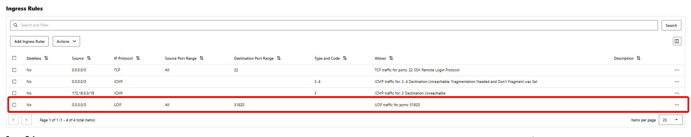

# Step-by-Step WireGuard VPN Setup (Oracle Linux 8 Server + Homelab Client)

## Part 1: Setup WireGuard Server on Oracle Linux 8 (OCI)
### Step 1: Install WireGuard
Oracle Linux 8 supports WireGuard via EPEL repository.
```
sudo dnf install -y epel-release
sudo dnf install -y wireguard-tools 
```
To confirm WireGuard is working:
```
which wg
which wg-quick
```
Then try:
```
wg --version
```
If those work, your installation is successful.


### Step 2: Enable IP Forwarding
Enable IP forwarding so your VPN server can route packets between VPN clients and OCI resources.
```
sudo sysctl -w net.ipv4.ip_forward=1
echo "net.ipv4.ip_forward=1" | sudo tee -a /etc/sysctl.conf
```

### Step 3: Generate Server Keys
```
umask 077
wg genkey | tee server_private.key | wg pubkey > server_public.key
```

### Step 4: Create WireGuard Config File /etc/wireguard/wg0.conf
```
[Interface]
PrivateKey = CGsxczNFNH8q9GQ1L1hQsNJhmdgSLvpZX6FcpBvkc28=
Address = 10.100.0.1/24
ListenPort = 51820

[Peer]
PublicKey = <homelab_public_key>
AllowedIPs = 10.100.0.2/32

```
* Replace <server_private_key> with the content of server_private.key.
* <homelab_public_key> will be generated on your homelab client.

### Step 5: Configure Firewall and OCI Security Lists
* Allow UDP port 51820 in Oracle Linux firewall:
```
sudo firewall-cmd --add-port=51820/udp --permanent
sudo firewall-cmd --reload
```
* In OCI Console, update VCN subnet security list or Network Security Group to allow inbound UDP 51820 to this VM.

  

### Step 6: Start and Enable WireGuard Service
```
sudo systemctl enable wg-quick@wg0
sudo systemctl start wg-quick@wg0
```

## Part 2: Setup WireGuard Client on Homelab (Ubuntu / Oracle Linux / etc.)

### Step 1: Install WireGuard

```
sudo dnf install -y epel-release
sudo dnf install -y wireguard-tools kmod-wireguard
```

### Step 2: Generate Client Keys
```
umask 077
wg genkey | tee client_private.key | wg pubkey > client_public.key
```

### Step 3: Create Client Config /etc/wireguard/wg0.conf

```
[Interface]
PrivateKey = <client_private_key>
Address = 10.100.0.2/32

[Peer]
PublicKey = <server_public_key>
Endpoint = <oci_public_ip>:51820
AllowedIPs = 0.0.0.0/0
PersistentKeepalive = 25
```
* Replace <client_private_key> with content of client_private.key.
* Replace <server_public_key> with content of server_public.key from server.
* Replace <oci_public_ip> with your OCI VM’s public IP address.
* AllowedIPs = 0.0.0.0/0 routes all traffic through the VPN. Adjust if you want selective routing.
* PersistentKeepalive = 25 ensures NAT traversal works behind home NAT.

### Step 4: Start and Enable WireGuard on Client
```
sudo systemctl enable wg-quick@wg0
sudo systemctl start wg-quick@wg0
```

## Part 3: Verify Connectivity

verify WireGuard Connectivity on homelab
```
wg show

output: 
[root@wgclient ~]# wg show
interface: wg0
  public key: 4ci0Y6FmJWKgmVt5JRxiqznj1r3TehDqbILZ6GQ6NXc=
  private key: (hidden)
  listening port: 59893
  fwmark: 0xca6c

peer: GyKAKVJ4o50adC2W3ye8tjQA/SEeJnr2D/8haw6+oUI=
  endpoint: 159.13.33.185:51820
  allowed ips: 0.0.0.0/0
  latest handshake: 6 seconds ago
  transfer: 92 B received, 328 B sent
  persistent keepalive: every 25 seconds
```

verify WireGuard Connectivity on oci

```
[root@wgserver ~]# sudo wg show
interface: wg0
  public key: GyKAKVJ4o50adC2W3ye8tjQA/SEeJnr2D/8haw6+oUI=
  private key: (hidden)
  listening port: 51820

peer: 4ci0Y6FmJWKgmVt5JRxiqznj1r3TehDqbILZ6GQ6NXc=
  endpoint: 139.5.250.55:59893
  allowed ips: 10.100.0.2/32
  latest handshake: 32 seconds ago
  transfer: 212 B received, 92 B sent
```

You should see:

* Interface: wg0 with IP 10.100.0.2
* Peer with public key of OCI server
* And hopefully a latest handshake time

from homelab
ping 10.100.0.1

from oci
ping 10.100.0.2

it should ping each other

## Optional: Routing OCI Subnet via VPN
If you want your homelab client to access OCI private subnets:
* On server /etc/wireguard/wg0.conf, add:

1. OCI WireGuard Server: /etc/wireguard/wg0.conf
```
[Interface]
Address = 10.100.0.1/24
PrivateKey = <OCI_PRIVATE_KEY>
ListenPort = 51820

# Enable IP forwarding and NAT
PostUp = sysctl -w net.ipv4.ip_forward=1
PostUp = iptables -t nat -A POSTROUTING -s 10.100.0.0/24 -d 172.16.0.0/16 -o eth0 -j MASQUERADE
PostDown = iptables -t nat -D POSTROUTING -s 10.100.0.0/24 -d 172.16.0.0/16 -o eth0 -j MASQUERADE

[Peer]
PublicKey = <HOMELAB_PUBLIC_KEY>
AllowedIPs = 10.100.0.2/32, 192.168.1.0/24
```

2. OCI Security List (VCN) & Firewalld Rules

* In OCI Console > VCN > Subnet > Security List:
    * Allow Ingress source: 10.100.0.0/24 all protocals.
    * Allow Egress to 10.100.0.0/24.

* On OCI VM (if firewalld is running):
```
sudo firewall-cmd --permanent --add-port=51820/udp
sudo firewall-cmd --permanent --add-rich-rule='rule family=ipv4 source address=10.100.0.0/24 accept'
sudo firewall-cmd --reload
```
### Test Access

```
# Start WireGuard
sudo wg-quick up wg0

# Test ping to OCI private instance
ping 172.16.0.10

# Or SSH
ssh opc@172.16.0.10
````
