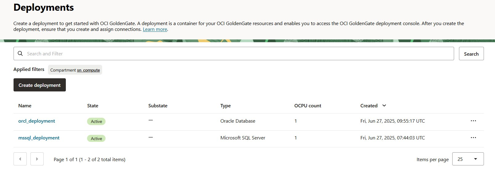
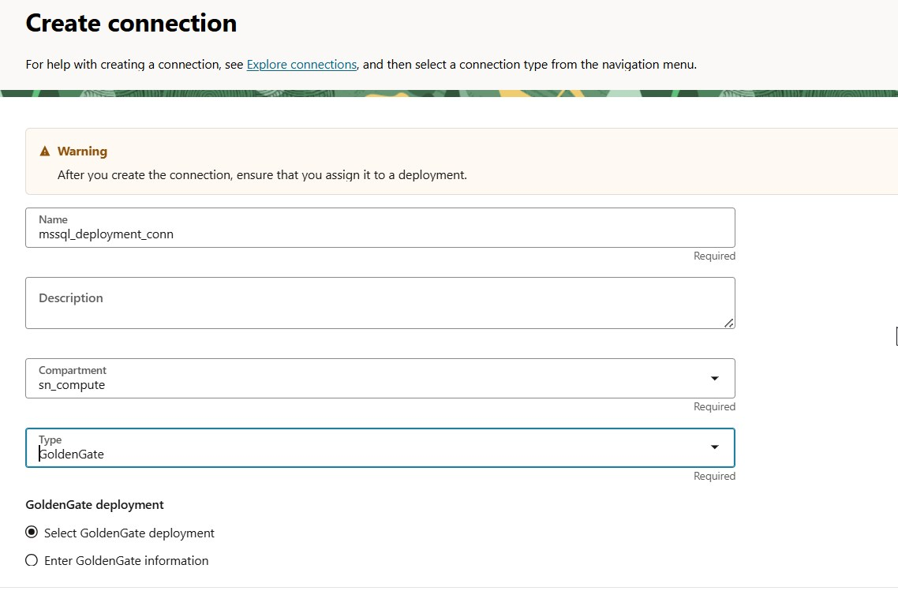
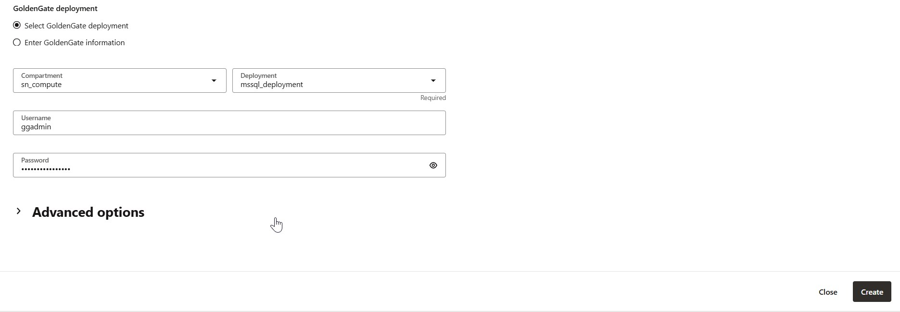
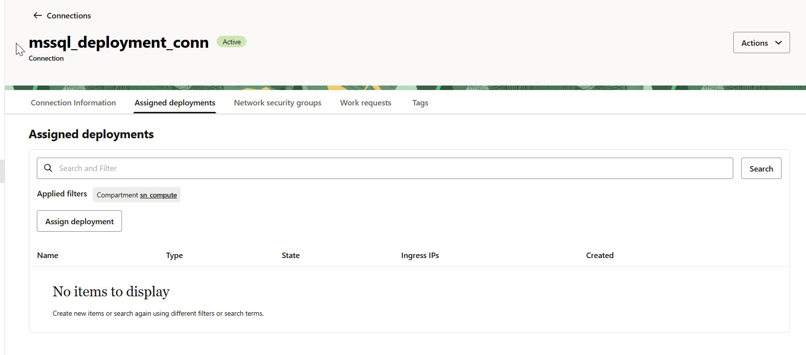
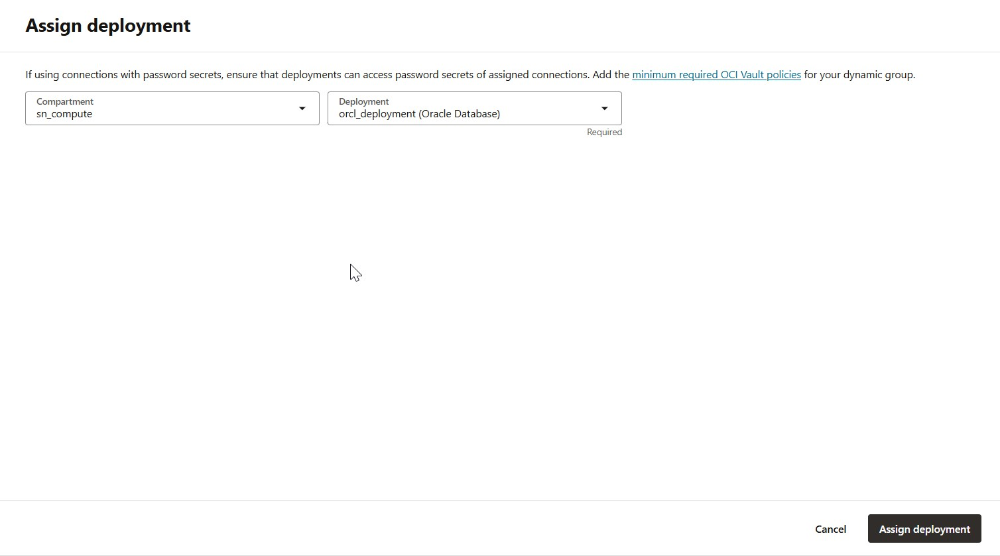
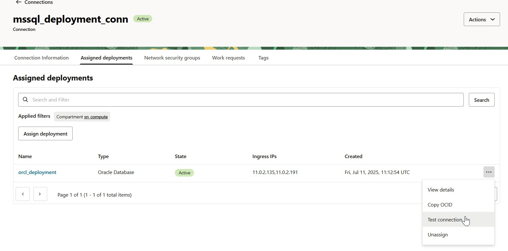
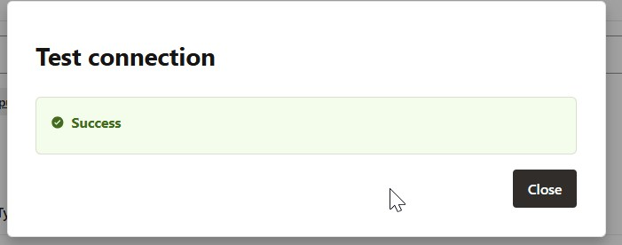

# Replication of tables from sqlserver to oracle database ATP 23ai

## identifiy the tables that need in replication at source ms sql server database.
*   IP_FILE 
*   IP_LOGO
*   IP_MARK_NICE_CLASSES
*   IP_MARK_WORDS

## on target create tables with required columns(not all columns)
CREATE TABLE IP_FILE (
    FILE_SEQ VARCHAR2(2) NOT NULL,
    FILE_TYP VARCHAR2(1) NOT NULL,
    FILE_SER NUMBER(4) NOT NULL,
    FILE_NBR NUMBER(10) NOT NULL,
    CONSTRAINT IP_FILE_PK PRIMARY KEY (
        FILE_NBR, FILE_SEQ, FILE_TYP, FILE_SER
    )
);

CREATE TABLE IP_LOGO (
    FILE_SEQ   VARCHAR2(2) NOT NULL,
    FILE_TYP   VARCHAR2(1) NOT NULL,
    FILE_SER   NUMBER(4)        NOT NULL,
    FILE_NBR   NUMBER(10)       NOT NULL,
    LOGO_DATA  BLOB,
    CONSTRAINT IP_LOGO_PK PRIMARY KEY (
        FILE_NBR, FILE_SEQ, FILE_TYP, FILE_SER
    )
);

CREATE TABLE IP_MARK_NICE_CLASSES (
    FILE_SEQ                 VARCHAR2(2)      NOT NULL,
    FILE_TYP                 VARCHAR2(1)      NOT NULL,
    FILE_SER                 NUMBER(4)             NOT NULL,
    FILE_NBR                 NUMBER(10)            NOT NULL,
    NICE_CLASS_DESCRIPTION   CLOB,
    NICE_CLASS_CODE          NUMBER(2)             NOT NULL,
    NICE_CLASS_STATUS_WCODE  VARCHAR2(1)      NOT NULL,
    CONSTRAINT IP_MARK_NICE_CLASSES_PK PRIMARY KEY (
        FILE_NBR, FILE_SEQ, FILE_TYP, FILE_SER, NICE_CLASS_CODE, NICE_CLASS_STATUS_WCODE
    )
);

CREATE TABLE UAETM.IP_MARK_WORDS (
    FILE_SEQ    VARCHAR2(2)    NOT NULL,
    FILE_TYP    VARCHAR2(1)    NOT NULL,
    FILE_SER    NUMBER(4)           NOT NULL,
    FILE_NBR    NUMBER(10)          NOT NULL,
    USAGE_CODE  VARCHAR2(2)    NOT NULL,
    MARK_WORD   VARCHAR2(254)  NOT NULL,
    CONSTRAINT IP_MARK_WORDS_PK PRIMARY KEY (
        FILE_NBR, FILE_SEQ, FILE_TYP, FILE_SER, USAGE_CODE, MARK_WORD
    )
);

## create goldengate deployment services 
one for oracle database ATP another for ms sqlserver

  

then create connections to oracle database and mssqlserver database
and also to establish communication between two deployments create goldengate connection and assign to each of them.

i.e: create goldengate connection to oracle deployment and assign to mssqlserver and vise versa.

  
  
  
  
  
  

