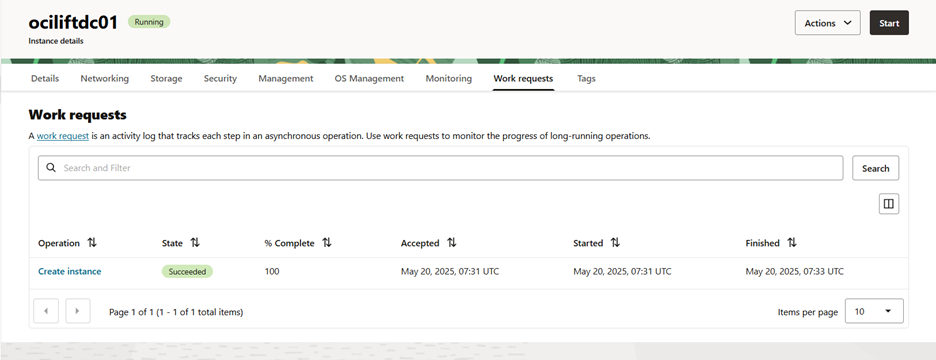
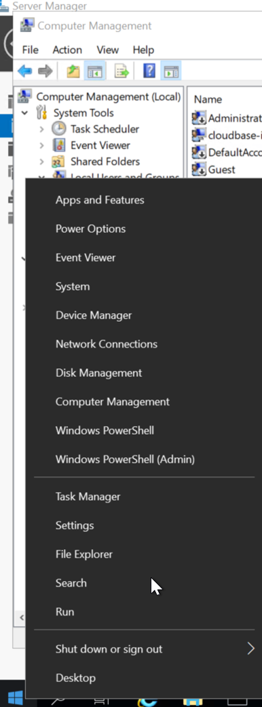

# Setting Up SQL Server 2019 Always On High Availability in OCI

## Introduction:
Always On Availability Groups (AG) is a high-availability and disaster recovery feature of SQL Server Enterprise Edition. When paired with Oracle Cloud Infrastructure (OCI), you get a robust, scalable, and resilient HA solution for mission-critical SQL workloads.
In this tutorial, we'll walk through deploying a 2-node AG cluster + domain controller in OCI with a listener for automatic failover.
The architecture needed for deploying SQL Server Always On availability groups. There are some specifics to deploying SQL Server on OCI that customers need to be aware of to make sure their SQL Server Always On availability groups deployment is successful.

The step-by-step procedures for deploying a two-node SQL Server Always On availability group. This constitutes the bulk of the tutorial. The same procedures can be used for deployments that use more than two nodes. This tutorial documents the procedures using the Windows Operating System graphical interface, which makes it adequate for non-advanced users. If you are an advanced user, you can implement the configuration using Windows PowerShell.

## Architecture
This tutorial uses the following architecture:
*	Single Region: The deployment comprises a single OCI region. The deployment could be extended to other OCI regions, but such configurations fall outside the scope of this tutorial.
*	Private Subnets: With the exception of an OCI Bastion virtual machine (VM), all resources are placed in private regional subnets.
*	SQL Server Nodes on Multiple Subnets: Each of the two nodes of the SQL Server deployment is placed in a different subnet as per Microsoft recommendations. For more information, see Prerequisites for availability groups in multiple subnets (SQL Server on Azure VMs). SQL Server Always On availability groups could be deployed in a single subnet but this is not a recommended architecture by Microsoft. Additionally, it will require the use of a load balancer and functionality not supported by OCI (direct server return).
*	Windows Server Failover Cluster Quorum Witness: Always On availability groups runs on a Windows Server Failover Cluster (WSFC). WSFC requires the use of a cluster quorum witness, for which there are several deployment options. This tutorial uses a file share witness, as it is optimal for an OCI deployment. To achieve this, I have used DC as a quorum witness VM.
*	SQL Server IPs needed: Each of the SQL Server VMs needs the following IPs in the primary Virtual Network Interface Cards (VNIC).
*	Primary IP: Operating System access (created automatically upon VM provisioning).
*	Secondary IP 1: Windows Server Failover Cluster IP. To be created in this tutorial.
*	Secondary IP 2: SQL Server Always On availability groups listener. To be created in this tutorial.
*	Accounts needed
*	Domain Administrator: Domain administrator performs all configuration tasks in this tutorial. This account also needs to be configured both as a local administrator on each SQL Server VM and as a member of SQL Server sysadmin fixed server role for each SQL Server instance.
*	Service Account: It is used for SQL Server service to operate on both SQL Server nodes.

## Firewall considerations

### Key Considerations
*	All VMs (SQLNode1, SQLNode2, QuorumVM) are in private subnets
*	AD and DNS are managed by DC01 (your Domain Controller)
*	SQL Server runs Always On AG with Windows Server Failover Cluster (WSFC)
*	You're using static port 1433 for SQL traffic (recommended)
 
### Inbound and Outbound Port Requirements
1. SQL Server Ports  

|Port |	Protocol |	Direction |	Purpose |  
|:----|:---------|:-----------|:--------|
| 1433 | TCP |	Inbound | Default SQL Server instance |
|1433 | TCP | Outbound | SQL client to peer node |
|1434 | TCP | Inbound  | SQL Server Browser (if used) |

 
> 📝 Use static port 1433 and disable dynamic ports to simplify firewall configs.
 
2. Always On AG & WSFC Ports  

|Port |	Protocol |	Direction |	Purpose |
|:----|:---------|:-----------|:--------|
|5022 |	TCP	| Inbound/Outbound	|AG data replication between nodes |
|135 |	TCP |	Inbound/Outbound |	RPC Endpoint Mapper (cluster, WMI) |
|3343 |	TCP/UDP |	Inbound/Outbound |	WSFC heartbeats |
 
 
3. Active Directory (DNS, Domain Join, etc.)

|Port |	Protocol |	Direction |	Purpose |
|:----|:---------|:-----------|:---------|
|53 |	TCP/UDP |	Inbound/Outbound |	DNS |
|88 |	TCP/UDP |	Inbound/Outbound |	Kerberos authentication |
|389 |	TCP/UDP	| Inbound/Outbound |	LDAP (domain queries) |
|445 |	TCP	| Inbound/Outbound |	SMB (file sharing, AD comm) |
|139 |	TCP	| Inbound/Outbound |	NetBIOS Session |
|137-138 |	UDP	| Inbound/Outbound |	NetBIOS Name/Datagram |
 
 
4. File Share Witness (Quorum)  

|Port |	Protocol |	Direction |	Purpose |
|:----|:---------|:-----------|:--------|
|445 |	TCP |	Inbound/Outbound |	SMB (file share access) |
|135	| TCP	| Inbound/Outbound	| RPC for file share comm|

## Setup Architecture

## Objectives
### Create and configure the following:
*   A Domain Controller
*   Two SQL Server Nodes
*   Quorum Witness Share
*	Users and accounts needed for SQL Server Always On availability groups.
*	A Windows Server Failover Cluster for Always On availability groups.
*	A SQL Server Always On availability group.

### Networking Considerations:
#### Provision OCI Infrastructure
Networking configured according to the architecture diagram.
*	1 VCN.
*	1 public subnet and 3 private subnets.
Create VCN and Subnets
*	CIDR: 11.0.0.0/16
*	Subnets:
    *	11.0.0.0/24 – Bastion VM
    *	11.0.1.0/24 – Domain Controller
    *	11.0.2.0/24 – SQL Node 1
    *	11.0.3.0/24 – SQL Node 2
*	Security list rules configured for implementing SQL Server Always On availability groups - 1433 and 5022 ports open.

> Document to configured using [Oracle Documentation for configuring DC in OCI]( https://docs.oracle.com/en-us/iaas/Content/Resources/Assets/whitepapers/creating-active-directory-domain-services-in-oci.pdf)

## Domain Controller on OCI Compute vm

Continue next until network  

  

&nbsp;
  

  

&nbsp;
  
to make the ip address static reserve the ip address    

&nbsp;
  
    
 

&nbsp;
  

>Use bastion service / bastion host to connect to the domain controler vm  
For this example I have created a jump host vm(windows) in public network and did rdp from there

From the Jump Box vm RDP to Domain Controller Server
 
   
Enable the administrator account and set password   

&nbsp;

    
 
&nbsp;

Select Computer management > Local Users and Groups > Users 

&nbsp;

   
   
  

&nbsp;

Uncheck account is disabled  

&nbsp;

&nbsp;
  

### Install Domain controller Feature 

&nbsp;

&nbsp;

Modify the dhcp options to point dns to our domain controller ip address by which it resolves using dns names.

&nbsp;

&nbsp;

Create a user(DBA) with administration privileges and add user as member of administrator group. 

&nbsp;
  
Active Directory Users and Computers  

### Create SQL Service Account
1.	On DC01, open Active Directory Users and Computers.
2.	Create user: mssqlsvc@ocilift.com , mssqlagent@ocilift.com
3.	Password never expires, cannot change password.
4.	Add sqlsvc to:
    *	Local Administrators on both SQL nodes  

&nbsp;

