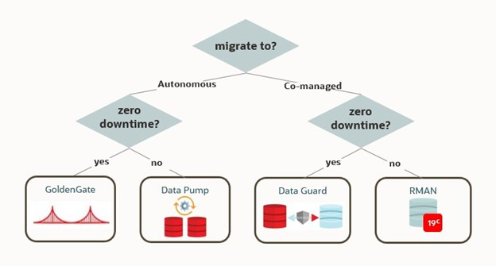
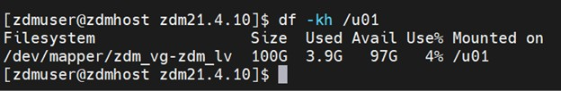
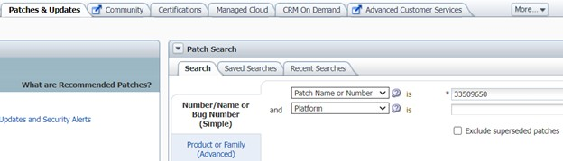
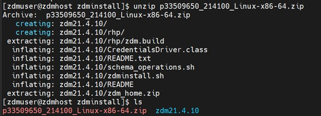
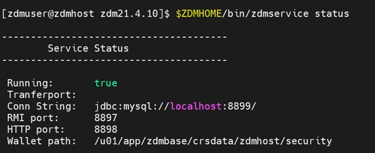
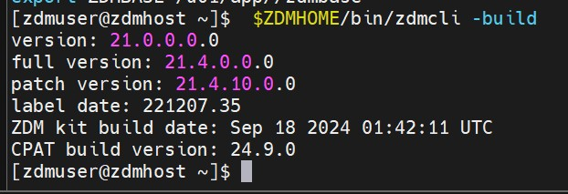
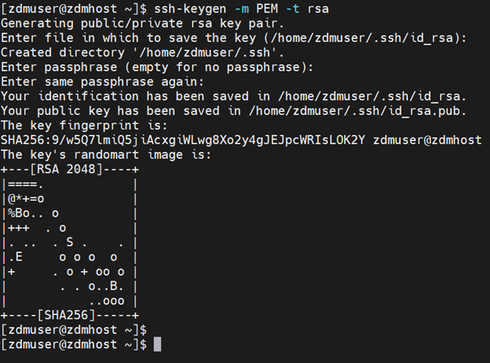
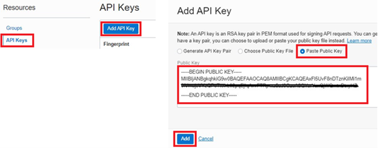

# Installing Oracle Zero Downtime Migration (ZDM) on Oracle Linux 7: A Step-by-Step Guide

## Table of Contents
1. [Introduction](#introduction) 
1. [Prerequisites](#prerequisites)
    1. [System Requirements](#-system-requirements)
    1. [Supported Database Versions](#-supported-database-versions)
    1. [Network & Port Requirements](#-network--port-requirements)
1. [Detailed Installation Steps](#detailed-installation-steps)
    1. [Step 1: Create System User and Directories](#-step-1-create-system-user-and-directories)
    1. [Step 2: Install Required OS Packages](#-step-2-install-required-os-packages)
    1. [Step 3: Download and Prepare ZDM Software](#-step-3-download-and-prepare-zdm-software)
    1. [Step 4: Configure Environment for zdmuser](#-step-4-configure-environment-for-zdmuser)
    1. [Step 5: Install ZDM](#-step-5-install-zdm)
    1. [Step 6: Start ZDM Service](#-step-6-start-zdm-service)
    1. [Step 7: Verify Installation](#-step-7-verify-installation)
    1. [Step 8: Post Installation Tasks](#-step-8-post-installation-tasks)
        1. [Generate SSH Key Pair (RSA format)](#-generate-ssh-key-pair-rsa-format)
        1. [Configure OCI API Key for CLI](#-configure-oci-api-key-for-cli)
        1. [Open Required Ports on DB Servers](#-open-required-ports-on-db-servers)
1. [Best Practices](#best-practices)
1. [Conclusion](#conclusion)


## Introduction

Migrating Oracle Databases with minimal downtime is a mission-critical task for modern enterprises. Oracle Zero Downtime Migration (ZDM) enables smooth, automated migrations of on-premises databases to Oracle Cloud Infrastructure (OCI) or Exadata with minimal disruption.

This blog post walks you through a detailed step-by-step installation of Oracle ZDM on an **Oracle Linux 7 host**, including prerequisite checks, configuration, and startup.



---

## Prerequisites

Before you install ZDM, ensure the following requirements are met:

### 🔹 System Requirements

* OS: Oracle Linux 7/8 or Red Hat Enterprise Linux 8
* Disk Space: Minimum 100 GB free  
    
* ZDM Service Host must not run Oracle Grid Infrastructure
* Able to SSH to source and target database servers

### 🔹 Supported Database Versions

* Source DB: Oracle 11.2.0.4 and later
* Target DB: Oracle 12c, 19c, 21c.23ai
* Supports: Single Instance, RAC One Node, Oracle RAC

### 🔹 Network & Port Requirements

| Component | Ports Required                       |
| :--------- | :------------------------------------ |
| ZDM Host  | Port 22 (SSH)                        |
| Source DB | Ports 1521 (Oracle Net), 443 (HTTPS) |
| Target DB | Ports 1521 (Oracle Net), 443 (HTTPS) |

> ⚠️ Ensure these ports are open and not blocked by firewalls.

---

## Detailed Installation Steps

### 🔸 Step 1: Create System User and Directories

Log in as `root` and create the necessary user and directories:

```bash
groupadd zdm
useradd -g zdm zdmuser

mkdir -p /u01/app/zdminstall
mkdir -p /u01/app/zdmhome
mkdir -p /u01/app/zdmbase

chown -R zdmuser:zdm /u01/app
```

---

### 🔸 Step 2: Install Required OS Packages

Still as `root`, run:

```bash
yum install glibc-devel expect -y
```

> Refer to Oracle’s official docs for additional packages if you're using Oracle Linux 8 or RHEL 8.

---

### 🔸 Step 3: Download and Prepare ZDM Software

1. Log in to [My Oracle Support](https://support.oracle.com)
2. Search for **Patch 33509650** (ZDM 21.4 or latest)  
    
3. Upload the zip to your server:  


```bash
chown zdmuser:zdm /u01/app/zdminstall/p33509650_214100_Linux-x86-64.zip
```

---

### 🔸 Step 4: Configure Environment for zdmuser

Switch to `zdmuser`:

```bash
su - zdmuser
```

Add environment variables in `.bash_profile`:

```bash
export ZDMHOME=/u01/app/zdmhome
export ZDMBASE=/u01/app/zdmbase
```

---

### 🔸 Step 5: Install ZDM

As `zdmuser`, unzip and install:

```bash
cd /u01/app/zdminstall
unzip p33509650_214100_Linux-x86-64.zip  
cd zdm21.4.10

./zdminstall.sh setup oraclehome=$ZDMHOME oraclebase=$ZDMBASE ziploc=/u01/app/zdminstall/zdm21.4.10/zdm_home.zip
```
.  
        

This will unzip the software, set up internal services, and configure secure credentials.

---

### 🔸 Step 6: Start ZDM Service

```bash
$ZDMHOME/bin/zdmservice start
$ZDMHOME/bin/zdmservice status
```
.
      
You should see debug logs and a confirmation that the service started successfully.

---

### 🔸 Step 7: Verify Installation

Check the installed version:

```bash
$ZDMHOME/bin/zdmcli -build
```
.   

---

### 🔸 Step 8: Post-Installation Tasks

#### ✅ Generate SSH Key Pair (RSA format)

```bash
ssh-keygen -p -m PEM -t rsa
```
. 


#### ✅ Configure OCI API Key for CLI

```bash
mkdir ~/.oci
openssl genrsa -out ~/.oci/oci_api_key.pem 2048
chmod go-rwx ~/.oci/oci_api_key.pem
openssl rsa -pubout -in ~/.oci/oci_api_key.pem -out ~/.oci/oci_api_key_public.pem
```

Upload `oci_api_key_public.pem` to OCI Console under your user → API Keys.




#### ✅ Open Required Ports on DB Servers

```bash
firewall-cmd --permanent --add-port=1521/tcp
firewall-cmd --reload
```

---

## Best Practices

* Use a **dedicated VM** for ZDM to avoid resource conflicts.
* Always **validate connectivity** (SSH, SQL\*Net) before starting a migration job.
* Run **CPAT (Cloud Premigration Advisor Tool)** before actual migration.
* Maintain proper **time sync** between ZDM, source, and target systems.
* Back up `.rsp` files and logs for audit purposes.
* Store SSH keys and OCI API keys securely.

---

## Conclusion

Installing Oracle Zero Downtime Migration on Oracle Linux 7 is a structured process that sets the foundation for seamless and resilient database migrations. With ZDM installed, you're now ready to automate migrations with minimal impact to your users.
