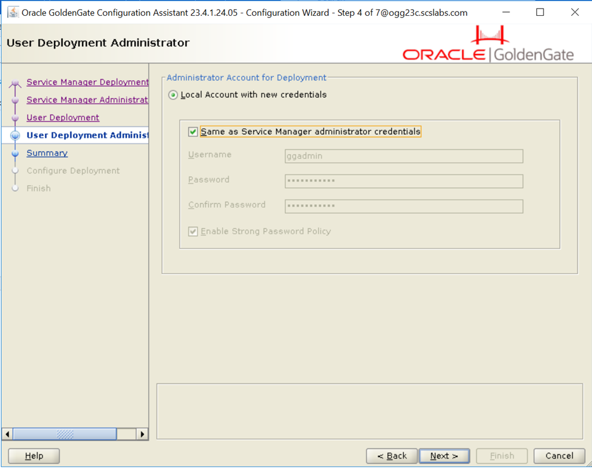
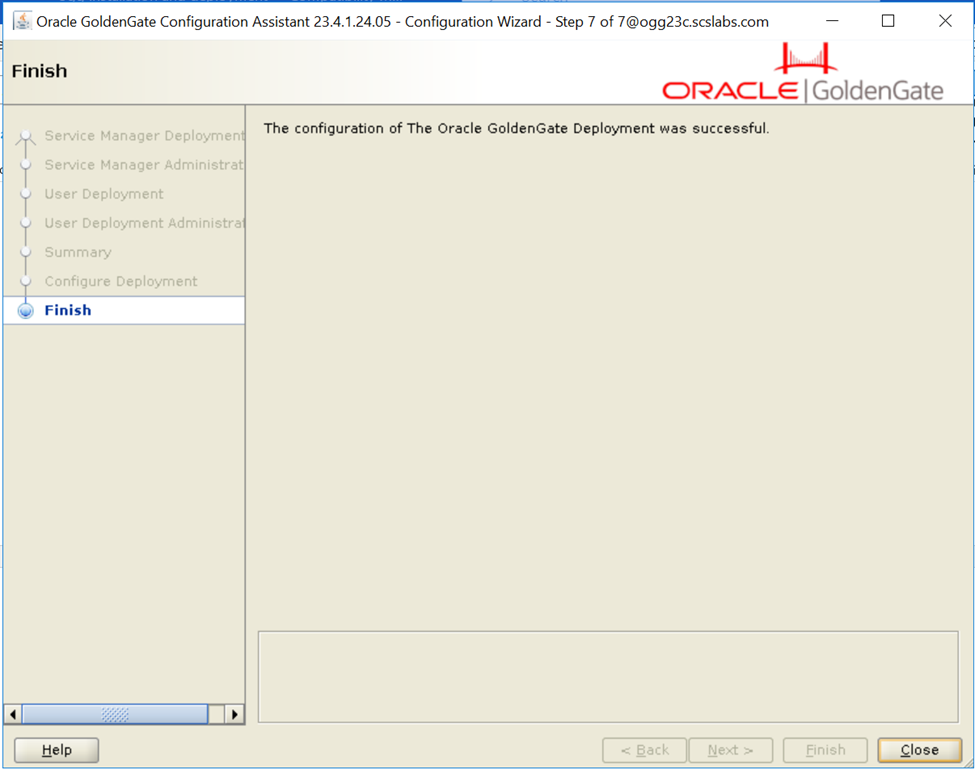

# Steps to install Goldengate 23ai
In this blog we will see how to install oracle Goldengate Microservice 23ai on oel8.

## Assumptions:
Oel8 os is already installed and downloaded gg 23ai software from oracle support.

Download and copy the software to server

```
[oracle@ogg23c]$ cd /u01/soft/
[oracle@ogg23c soft]$ ls
V1042871-01.zip
```

**Unzip the zip file**
```
[oracle@ogg23c soft]$ unzip V1042871-01.zip
Archive:  V1042871-01.zip
  inflating: META-INF/MANIFEST.MF
  inflating: META-INF/ORACLE_C.SF
  inflating: META-INF/ORACLE_C.RSA
   creating: fbo_ggs_Linux_x64_Oracle_services_shiphome/
   creating: fbo_ggs_Linux_x64_Oracle_services_shiphome/Disk1/
.
.
.
   creating: fbo_ggs_Linux_x64_Oracle_services_shiphome/Disk1/response/
  inflating: fbo_ggs_Linux_x64_Oracle_services_shiphome/Disk1/response/oggcore.rsp
  inflating: fbo_ggs_Linux_x64_Oracle_services_shiphome/Disk1/runInstaller
  inflating: OGGCORE_Release_Notes_23.4.1.24.05.pdf
  inflating: OGG-23ai-README.txt
  ```

```
[oracle@ogg23c soft]$ ls
fbo_ggs_Linux_x64_Oracle_services_shiphome  OGG-23ai-README.txt                     V1042871-01.zip
META-INF                                    OGGCORE_Release_Notes_23.4.1.24.05.pdf
[oracle@ogg23c soft]$
```
```
[oracle@ogg23c Disk1]$ pwd
/u01/soft/fbo_ggs_Linux_x64_Oracle_services_shiphome/Disk1

[oracle@ogg23c Disk1]$ ls
install  response  runInstaller  stage

[oracle@ogg23c Disk1]$ ./runInstaller
Starting Oracle Universal Installer...

Checking Temp space: must be greater than 120 MB.   Actual 54089 MB    Passed
Checking swap space: must be greater than 150 MB.   Actual 4095 MB    Passed
Checking monitor: must be configured to display at least 256 colors.    Actual 16777216    Passed
Preparing to launch Oracle Universal Installer from /tmp/OraInstall2024-06-25_01-43-17PM. Please wait ...[oracle@ogg23c Disk1]$
```
 
 
 
 
 

run orainstRoot.sh as root user

```
[root@ogg23c ~]# /u01/app/oraInventory/orainstRoot.sh
Changing permissions of /u01/app/oraInventory.
Adding read,write permissions for group.
Removing read,write,execute permissions for world.

Changing groupname of /u01/app/oraInventory to oinstall.
The execution of the script is complete.
[root@ogg23c ~]#
```
 

configure the deployment home
```
[oracle@ogg23c bin]$ ./oggca.sh
```
 
 
 
 
 
 
 
 
 

```
[root@ogg23c ~]# /u01/app/ogg/ogg_sa/bin/registerServiceManager.sh
Copyright (c) 2017, 2024, Oracle and/or its affiliates. All rights reserved.
----------------------------------------------------
     Oracle GoldenGate Install As Service Script
----------------------------------------------------
OGG_HOME=/u01/app/ogg/ogg_home
OGG_CONF_HOME=/u01/app/ogg/ogg_sa/etc/conf
OGG_VAR_HOME=/u01/app/ogg/ogg_sa/var
OGG_USER=oracle
Running OracleGoldenGateInstall.sh...
Created symlink /etc/systemd/system/multi-user.target.wants/OracleGoldenGate.service → /etc/systemd/system/OracleGoldenGate.service.
[root@ogg23c ~]#
```



service manager console


