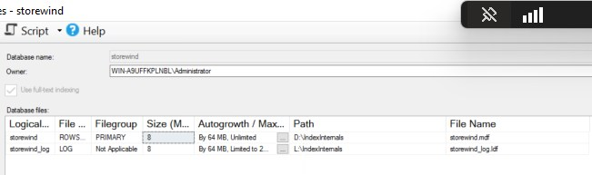
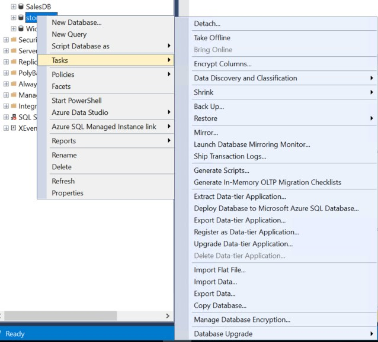
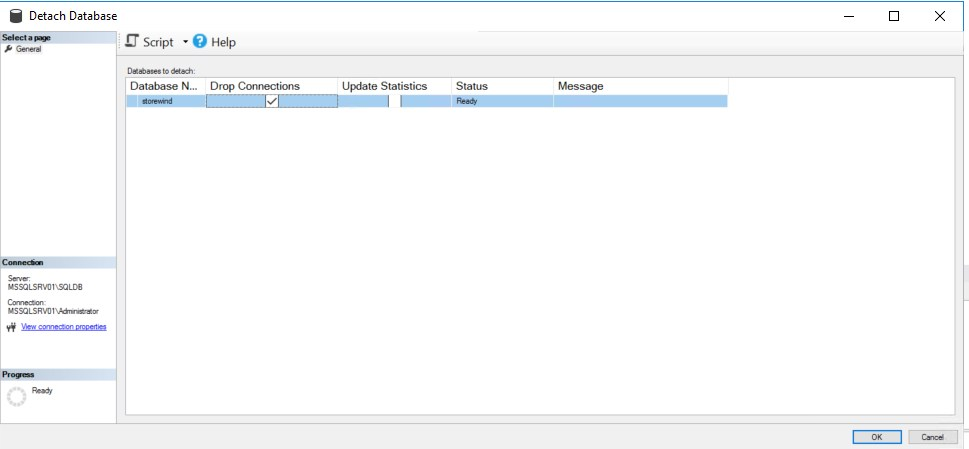
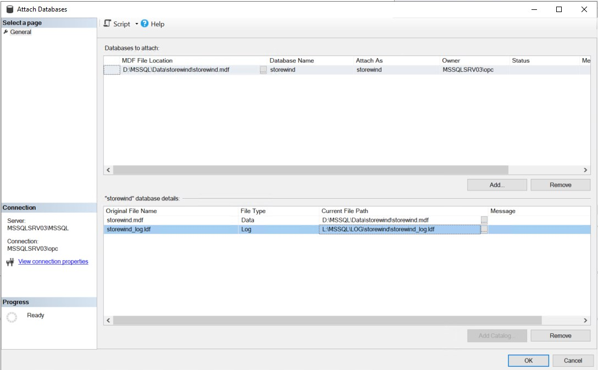
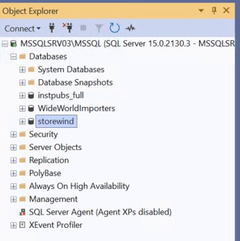

# SQL Server Detach and Attach Migration Method – Step-by-Step Guide

When migrating a SQL Server database to a new server (e.g., moving to Oracle Cloud Infrastructure), one of the simplest and fastest options is the **Detach and Attach** method. It allows you to move your database files (MDF, LDF) from one instance to another with minimal downtime—ideal for standalone SQL Server environments.

---
## Use Case

* Standalone SQL Server database
* Minimal complexity
* No need for continuous sync
* If You’re okay with **a short downtime window**
---

## 🧰 Requirements

* SQL Server installed on both **source** and **target** servers
* Admin access to both servers
* File transfer method (e.g., SFTP, external drive, OCI object storage)
* Sufficient disk space on target server
---

## ✅ Step-by-Step: Detach and Attach Method

---

### 🔹 Step 1: Prepare for Migration

Before detaching:

1. **Stop all application access** to the database
2. **Backup** the database (as a precaution)
3. Make note of file paths of the `.mdf` and `.ldf` files  
   
---

### 🔹 Step 2: Detach the Database (on Source)

Open SQL Server Management Studio (SSMS):

1. Right-click the database → **Tasks > Detach**  
   
2. In the dialog:

   * Check the **Drop Connections** box
   * Click **OK**  
    

Or use T-SQL:

```sql
USE master;
GO
ALTER DATABASE MyDB SET SINGLE_USER WITH ROLLBACK IMMEDIATE;
EXEC sp_detach_db 'MyDB';
```

---

### 🔹 Step 3: Copy MDF and LDF Files

Manually copy the `.mdf` and `.ldf` files from the source server to the target server:

Use one of the following:

* WinSCP / FileZilla (SFTP)
* External drive or USB (if on-prem)
* OCI Object Storage (upload then download on target) --> i have used object storage.

---

### 🔹 Step 4: Attach the Database (on Target)

Once files are in place on the new server:

1. Open SSMS → Connect to target SQL Server
2. Right-click **Databases** → **Attach**
3. Click **Add**, select the `.mdf` file
4. SQL Server will auto-detect the `.ldf` file  
    

Or use T-SQL:

```sql
CREATE DATABASE MyDB
ON (
   FILENAME = 'C:\SQLData\MyDB.mdf'
), (
   FILENAME = 'C:\SQLLogs\MyDB_log.ldf'
)
FOR ATTACH;
```  

      
---

### 🔹 Step 5: Fix Orphaned Users (if needed)

After attaching, re-map users:

```sql
USE MyDB;
EXEC sp_change_users_login 'Auto_Fix', 'your_username';
```

---

### 🔹 Step 6: Verify and Enable Access

* Confirm data is accessible
* Re-enable application connections
* Recreate jobs, logins, linked servers if needed

---

## 🛡️ Best Practices

* Keep a backup of `.mdf` and `.ldf` files before detaching
* Always use `WITH ROLLBACK IMMEDIATE` to avoid hanging sessions
* Do not detach system databases (e.g., `master`, `msdb`)
* Use NTFS permissions properly on destination folder

---

## 🧪 Advantages of Detach/Attach

| Feature                      | Benefit                         |
| ---------------------------- | ------------------------------- |
| Simple to execute            | No advanced tools needed        |
| Fast                         | Just file copy + attach         |
| Ideal for offline migrations | No sync or replication required |

---

## ⚠️ When Not to Use It

* You need **zero-downtime** (use Log Shipping or Always On instead)
* Migrating between **different SQL Server versions** (backup/restore is safer)
* You don’t have file system access

---

## 🏁 Conclusion

The **Detach and Attach** method is a quick, reliable way to move standalone SQL Server databases—especially for planned migrations to OCI or other cloud environments. With just a few steps, you can take your database offline, move it, and bring it back online with minimal complexity.

this method is feasible if the database size is small. 
---
