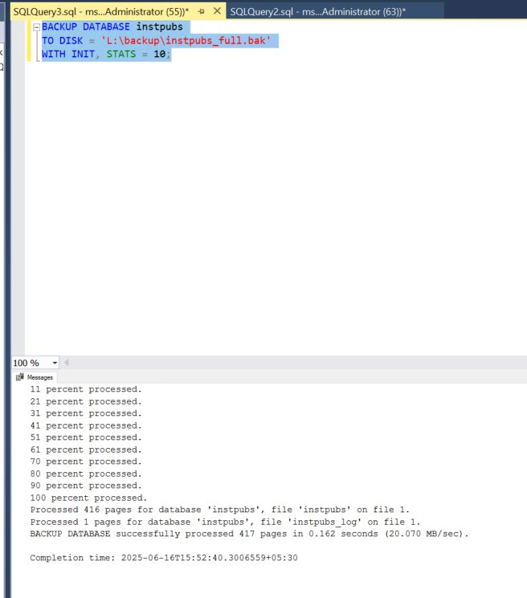
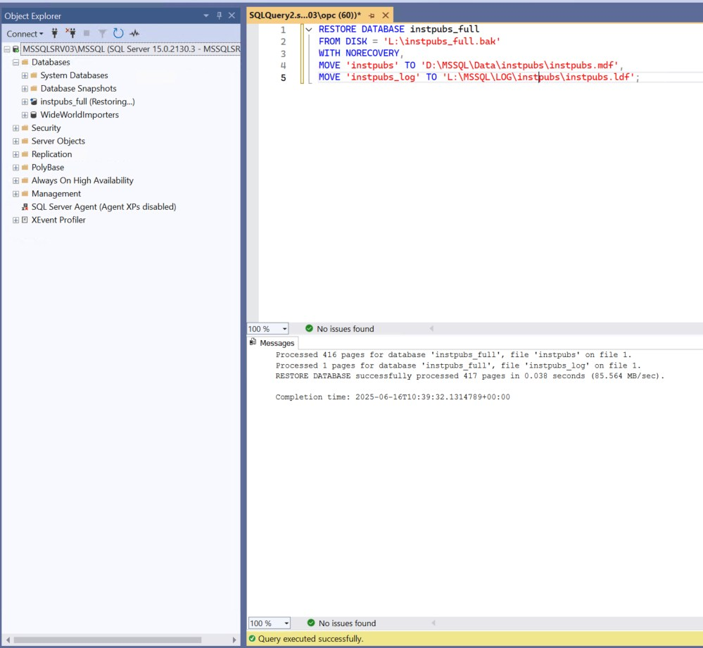
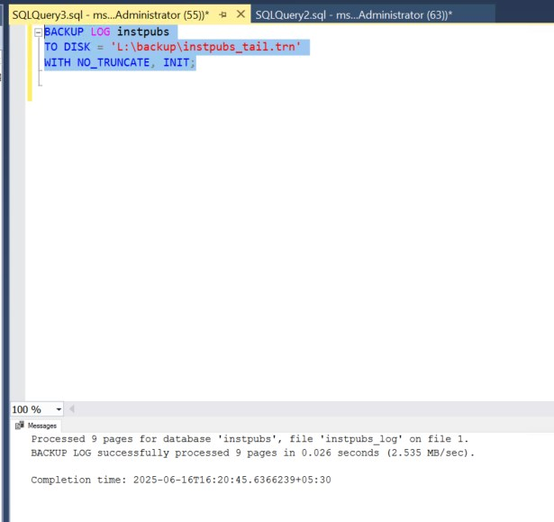
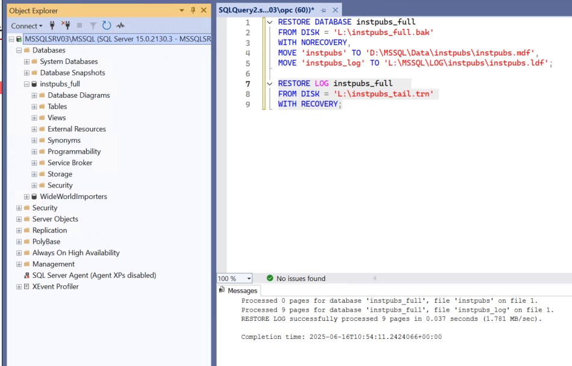

# SQL Server Standalone Migration to OCI Using Backup & Restore with Reduced Downtime

Migrating SQL Server to Oracle Cloud Infrastructure (OCI) doesn’t have to mean extended downtime. With the **Backup and Restore** method, you can **stage the database first** and then **restore differential and transaction log backups** just before the cutover—minimizing downtime to just a few minutes.

This guide walks you through that **staged migration approach**, ideal for production environments needing **low disruption**.

---

## 🎯 Objective

Migrate a SQL Server standalone instance from on-premises (or another cloud) to **OCI Compute VM**, while minimizing application downtime.

---

## 🧰 Prerequisites

* Source: SQL Server 2016+ standalone instance (Enterprise or Standard)
* Target: OCI Compute VM with Windows Server and SQL Server installed
* Network access: SFTP, SMB, or OCI Object Storage for file transfers
* Backup location shared or accessible by both source and OCI VM
* Downtime window for final log restore and cutover

---

## 🛠️ Step-by-Step Migration (Staged Backup + Final Log Restore)

---

### ✅ Step 1: Provision OCI Infrastructure

1. Create an OCI VM with:

   * **Windows Server 2019/2022**
   * **SQL Server 2019 or 2022**
   * Attach at least **100–200 GB** of storage for data/logs

2. Enable:

   * **TCP 1433 (SQL Server)**
   * **TCP 3389 (RDP)**
   * Use **NSG** or **Security Lists** to restrict access

---

### ✅ Step 2: Prepare SQL Server on OCI

* Install SQL Server instance
* Enable mixed-mode authentication if needed
* Create folder structure for backups:

  ```
  C:\Backup
  ```

---

### ✅ Step 3: Perform Full Backup on Source Server

On your **source SQL Server**:

```sql
BACKUP DATABASE instpubs
TO DISK = 'L:\backup\instpubs_full.bak'
WITH INIT, STATS = 10;
```
  

Transfer `instpubs_full.bak` to the OCI VM (via WinSCP, SFTP, or object storage).

---

### ✅ Step 4: Restore Full Backup on Target (NoRecovery)

On **OCI SQL Server**:

```sql
RESTORE DATABASE instpubs_full
FROM DISK = 'L:\instpubs_full.bak'
WITH NORECOVERY,
MOVE 'instpubs' TO 'D:\MSSQL\Data\instpubs\instpubs.mdf',
MOVE 'instpubs_log' TO 'L:\MSSQL\LOG\instpubs\instpubs.ldf';
```
  

This leaves the database in a **restoring state**, allowing future log restores.

---

### ✅ Step 5: Take and Apply Differential or Log Backups (Staging)

Repeat this multiple times **before final cutover**.

#### On Source:

```sql
BACKUP LOG instpubs TO DISK = 'L:\backup\instpubs_log1.trn' WITH INIT;
```

#### Transfer & Restore on Target:

```sql
RESTORE LOG instpubs_full FROM DISK = 'L:\instpubs_log1.trn' WITH NORECOVERY;
```

Repeat as needed. Each time you back up logs and restore, you're bringing the target closer to current.

---

### ✅ Step 6: Final Downtime + Last Log Backup + Restore

At the scheduled **cutover time**:

1. Stop application access to the source database

2. Take **tail-log backup**:

   ```sql
   BACKUP LOG instpubs
   TO DISK = 'L:\backup\instpubs_tail.trn'
   WITH NO_TRUNCATE, INIT;
   ```

   


3. Transfer it to OCI

4. **Restore final log with RECOVERY** on OCI SQL Server:

```sql
RESTORE LOG [MyDB]
FROM DISK = 'C:\Backup\MyDB_tail.trn'
WITH RECOVERY;
```
   
Database is now **online** on OCI 🎉

---

### ✅ Step 7: Reconfigure Users, Jobs, and Applications

* Recreate logins if needed
SQL logins aren’t stored inside `.bak` files. Recreate them using this script on the source server:

```sql
SELECT
    'CREATE LOGIN [' + sp.name + '] WITH PASSWORD = ' +
    CONVERT(VARCHAR(MAX), sl.password_hash, 1) + ' HASHED, CHECK_POLICY = ' +
    CASE WHEN sl.is_policy_checked = 1 THEN 'ON' ELSE 'OFF' END + ';' AS CreateLoginScript
FROM sys.server_principals sp
JOIN sys.sql_logins sl ON sp.principal_id = sl.principal_id
WHERE sp.type_desc = 'SQL_LOGIN'
AND sp.name NOT IN ('sa');  -- Exclude 'sa' if you like
```


```sql db users
USE YourDatabaseName;
SELECT name FROM sys.database_principals WHERE type IN ('S', 'U');
```
```sql Server-level login
SELECT name FROM sys.server_principals WHERE type IN ('S', 'U');
```
* Test SQL Agent jobs and linked servers
* Update application connection strings

---

## 📊 Downtime Summary

| Task                      | Downtime Impact   |
| ------------------------- | ----------------- |
| Full backup/transfer      | ❌ No downtime     |
| Initial full restore      | ❌ No downtime     |
| Log backups/restores      | ❌ No downtime     |
| Final tail-log backup     | ✅ Downtime starts |
| Final log restore/cutover | ✅ End downtime    |

> ✅ Actual downtime is reduced to the time it takes to back up the last log, transfer it, and apply it—**typically under 5 minutes**.

---

## 🛡️ Post-Migration Checklist

* ✅ Backup OCI VM (boot volume snapshot)
* ✅ Monitor performance (CPU, disk I/O)
* ✅ Implement scheduled backups
* ✅ Secure with OCI Vault and NSG rules
* ✅ Enable monitoring/alerts

---

## 🏁 Conclusion

By leveraging **staged log backups and restoring with NORECOVERY**, you can achieve a **low-downtime SQL Server migration** to Oracle Cloud Infrastructure using just built-in tools. This approach is especially effective when high availability is not in place but minimal interruption is still required.

---

