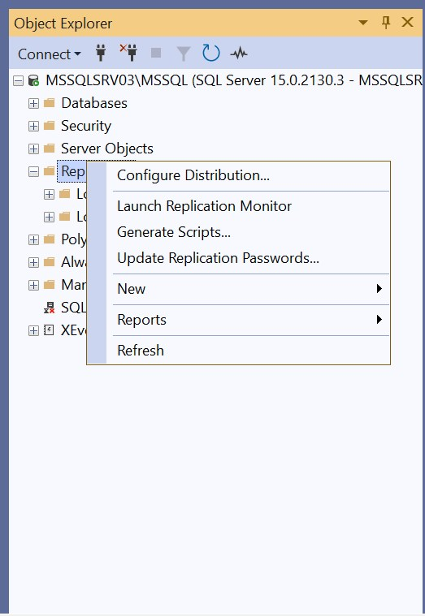
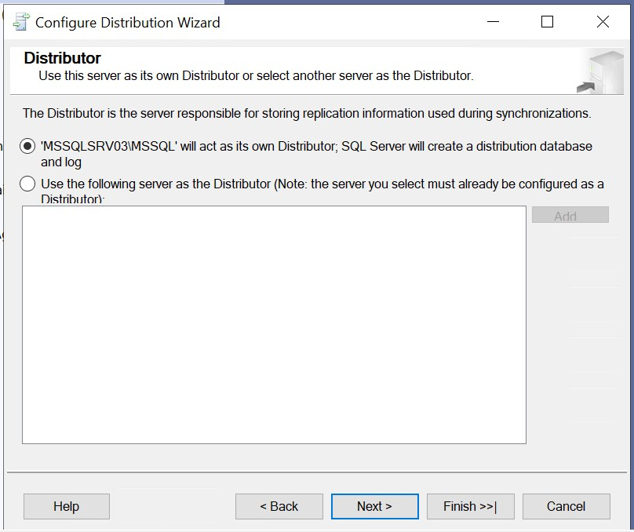
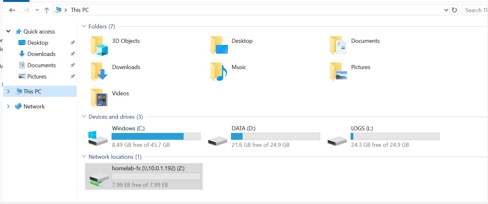
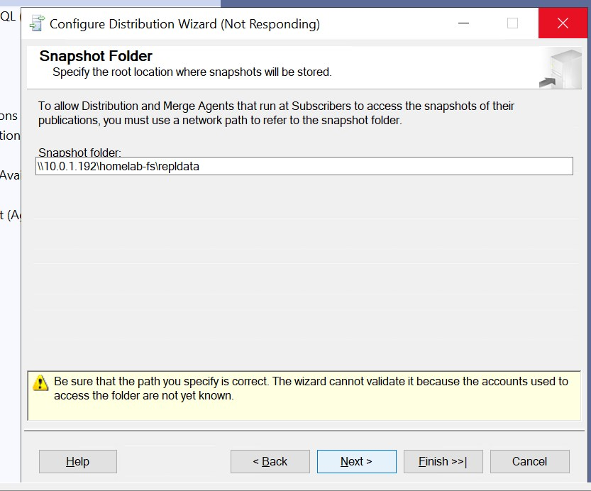
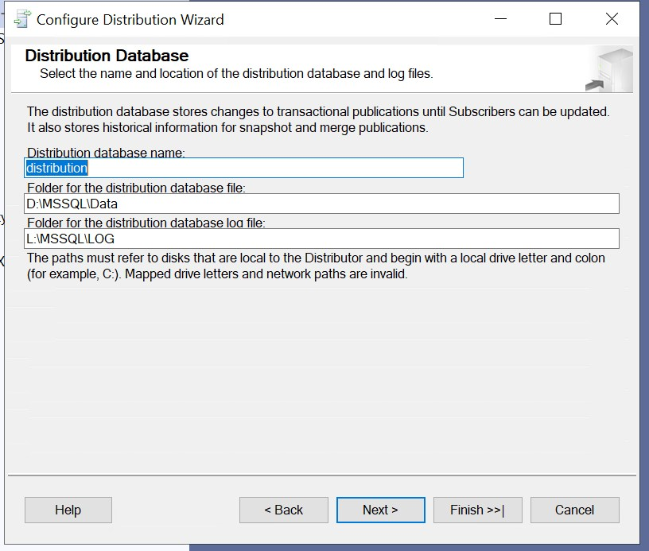
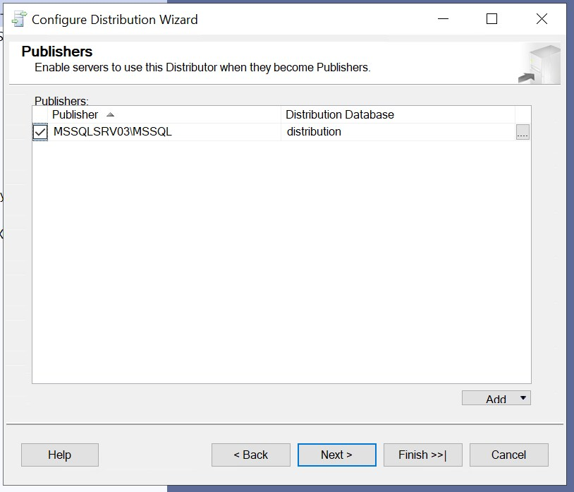
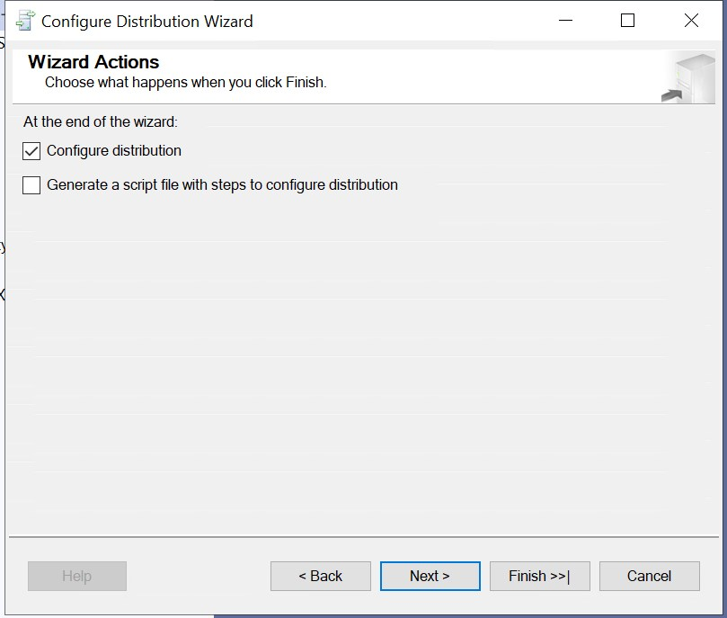
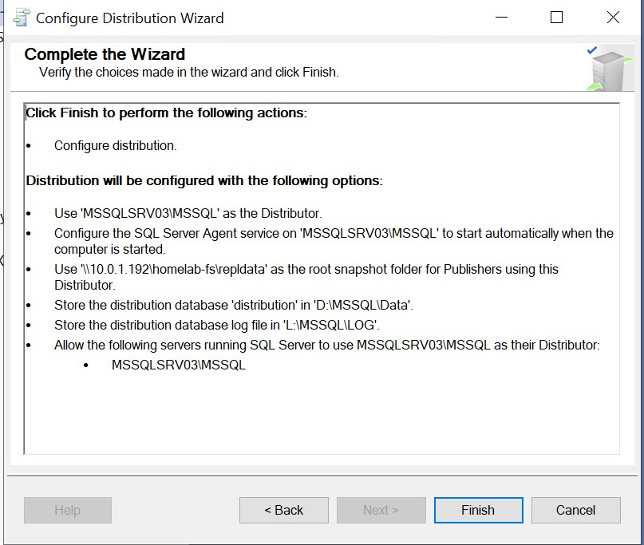
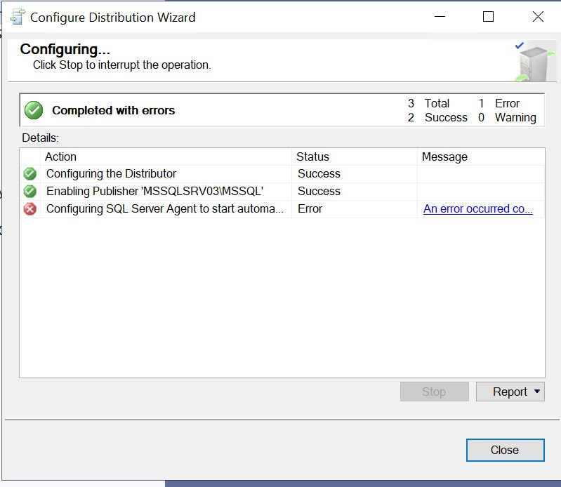

# Migrate Standalone SQL Server to OCI Using Replication (Low-Downtime Method)

When migrating SQL Server to Oracle Cloud Infrastructure (OCI), you may want to **minimize downtime** and keep source and target environments **in sync** until a final switchover. One reliable approach is to use **SQL Server Transactional Replication** to **replicate your data to a new OCI SQL Server**, and then cut over during a planned window.

This blog post walks you through how to use **replication as a migration tool** from on-prem SQL Server to OCI.

---

## 🎯 Use Case

* **Source:** On-premises SQL Server (standalone, no replication)
* **Target:** SQL Server in OCI Compute VM (standalone)
* **Goal:** Migrate with low downtime using **Transactional Replication**

---

## ✅ Why Use Replication for Migration?

* Minimal downtime (only at cutover time)
* Keeps OCI SQL Server synced in near real-time
* Safer than backup/restore when large databases or remote connectivity are involved
* Easy to test and validate in OCI before final cutover

---

## 🛠️ Step-by-Step: SQL Server Replication-Based Migration to OCI

---

### 🔹 Step 1: Prepare Target SQL Server in OCI

* Create a Windows Server VM in OCI
* Install **SQL Server (same or newer version than on-prem)**
* Ensure ports 1433 (SQL) and 445 (SMB for snapshot folder if needed) are open
* Create a folder for replication snapshot (e.g., `\\10.0.1.192\homelab-fs` OCI FSS)

---

### 🔹 Step 2: Configure the On-Prem Server as Publisher

> On your on-prem SQL Server:

1. Open **SSMS**
2. Right-click **Replication → Configure Distribution**
  
3. Let the local server be the **Distributor**
  
4. Use a shared folder for snapshot files (e.g., `\\OnPremSQL\ReplData`)
  
  
  
  
  
  
  

if distribution service failed
You need to enable the Agent XPs component using the sp_configure system stored procedure.
follow below steps:
```
EXEC sp_configure 'show advanced options', 1;

RECONFIGURE;

EXEC sp_configure 'Agent XPs', 1;
RECONFIGURE;
```
After running these commands, try running the Distribution Wizard again.

---

### 🔹 Step 3: Create a Publication on On-Prem

Still on the **on-premises SQL Server**:

1. Right-click **Local Publications → New Publication**
2. Select the database you want to migrate
3. Choose **Transactional Replication**
4. Select tables (or all objects) to include
5. Use a **push subscription**
6. Configure snapshot agent (manual or scheduled)
7. Complete the wizard

---

### 🔹 Step 4: Configure Target SQL Server as a Subscriber

On the **on-prem SQL Server**:

1. Right-click the new publication → **New Subscription**
2. Choose **Push Subscription**
3. Connect to the OCI SQL Server (use IP or FQDN)
4. Choose a new, empty database on OCI to be the Subscriber
5. Set the replication agent to run under a valid domain or SQL account
6. Start the **initial snapshot** and sync

> At this point, your OCI server will start replicating data from on-prem in near real-time.

---

### 🔹 Step 5: Monitor and Validate Replication

* Use **Replication Monitor** in SSMS
* Confirm that data changes on-prem reflect on the OCI SQL Server
* Validate row counts, indexes, and schema objects

---

### 🔹 Step 6: Final Cutover (Minimal Downtime)

When you're ready to go live:

1. **Stop application access** to the on-prem SQL Server
2. Wait for **replication to catch up** (zero latency)
3. **Drop the replication**:

   ```sql
   sp_dropsubscription ...
   sp_droppublication ...
   ```
4. Point your application to the **OCI SQL Server**

✅ Done! Your database has now been migrated to OCI with **almost zero downtime**.

---

## 🔐 Security Notes

* Use **SQL authentication** if OCI and on-prem are in different domains
* Use **NSGs or Security Lists** in OCI to restrict access to port 1433
* Secure your snapshot folder using shared folder permissions

---

## 🧪 Pro Tips

| Tip                           | Benefit                                  |
| ----------------------------- | ---------------------------------------- |
| Use FQDN for subscriber       | More resilient than IP-based connection  |
| Re-index subscriber DB        | Improves post-cutover performance        |
| Take a final backup           | For safety before switching applications |
| Test with a small table first | Validates replication settings quickly   |

---

## 🏁 Summary

| Task                           | Status |
| ------------------------------ | ------ |
| Set up OCI SQL Server VM       | ✅      |
| Configure on-prem as publisher | ✅      |
| Set up push subscription       | ✅      |
| Sync data to OCI               | ✅      |
| Cutover during planned window  | ✅      |

---

## 📘 Conclusion

SQL Server Transactional Replication is an excellent strategy to **migrate databases to OCI** with minimal disruption. It gives you full control, supports near real-time sync, and helps reduce risk by letting you **test the new server in parallel** before making it live.

---

Would you like a **T-SQL script pack** to automate publication and subscription setup for this migration?
