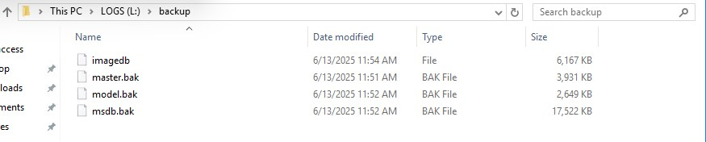

# Steps to upgrade mssql server 2016 to 2019

Upgrading Microsoft SQL Server 2016 to SQL Server 2019 is a straightforward process, but it requires careful planning to avoid downtime or data loss. Here's a step-by-step guide for an **in-place upgrade** of SQL Server 2016 to 2019:

---

### ✅ **Pre-Upgrade Checklist**

1. **Review Upgrade Path**

   * You can **directly upgrade** from SQL Server 2016 to SQL Server 2019.

2. **Check Edition Compatibility**

   * Ensure that the edition (e.g., Standard, Enterprise) you're upgrading to matches or supports upgrade from your current edition.

3. **Check Supported Features**

   * Use the **SQL Server 2019 documentation** to ensure your used features are supported.

4. **Run Database Consistency Check**

   ```sql
   DBCC CHECKDB;
   ```
     

5. **Back Up Everything**

   * Full backups of all user and system databases (master, msdb, model).  
     
    select the backup location and take backup.  
      
      
    i have taken all databases backup.  
      
   * Backup SQL Server Agent jobs, Linked Servers, SSIS packages (if any), etc.
   * OS-level snapshot (optional but recommended in virtual environments).

6. **Check Disk Space**

   * Ensure you have **at least 6–10 GB free** on the drive where SQL Server is installed.

7. **Note Service Packs or CUs**

   * Document current build version (`SELECT @@VERSION`).  

     

8. **Download SQL Server 2019 Setup**

   * Download from Microsoft: [https://www.microsoft.com/en-us/sql-server/sql-server-downloads](https://www.microsoft.com/en-us/sql-server/sql-server-downloads)

---

### 🛠️ **Upgrade Steps**

#### Step 1: Install SQL Server 2019 Setup

1. Mount or extract the SQL Server 2019 ISO.
2. Run **`setup.exe`** as Administrator.  
  

#### Step 2: Select Upgrade Option

1. In the SQL Server Installation Center:

   * Click **"Installation"** → **"Upgrade from a previous version of SQL Server"**.  
  

#### Step 3: Select Instance to Upgrade

1. Select the existing **SQL Server 2016 instance** you want to upgrade.  
 

#### Step 4: Install Setup Support Files

* Let the wizard run rule checks.
* Address any failures (e.g., pending reboots, missing .NET Framework, etc.)

#### Step 5: Select Features

* Features already installed will be selected by default. You can’t add features during upgrade.  
 

#### Step 6: Instance Configuration  

* Confirm instance name and upgrade location.  
 

#### Step 7: Ready to Upgrade
  

* Accept license terms.
* Click **Upgrade** to begin the process.

> 🕐 **Time Taken:** Upgrade duration varies based on instance size, databases, and features (\~15–45 min typical).
 
---

### ✅ **Post-Upgrade Tasks**

1. **Apply Latest Cumulative Update for SQL Server 2019**

   * Download from: [https://learn.microsoft.com/en-us/sql/sql-server](https://learn.microsoft.com/en-us/sql/sql-server)

2. **Check Compatibility Level**

   * After upgrade, databases remain on SQL 2016 compatibility (130).
   * Change to 150 (SQL 2019) **after testing**:

     ```sql
     ALTER DATABASE [YourDB] SET COMPATIBILITY_LEVEL = 150;
     ```
      

3. **Verify Services and Jobs**

   * Confirm Agent jobs, linked servers, SSIS/SSRS/SSAS components work properly.

4. **Run DBCC CHECKDB Again**

   * Validate database integrity post-upgrade.

5. **Monitor Logs**

   * Review `ERRORLOG` for any upgrade-related issues:

     ```sql
     EXEC xp_readerrorlog;
     ```
     
---
